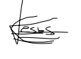

# Protocolo interno para la gestión de conflictos y rendimiento en la Asignatura ISPP (Ingeniería del Software y Práctica Profesional) - Curso 2024-25

**Nombre del Alumno:** Jesús Fernández Rodríguez  
**Fecha:** 13/02/2025  
**Grupo de Trabajo:** 4  

## 1. OBJETIVO Y ALCANCE  

El presente documento establece las directrices para la gestión de conflictos y situaciones de bajo rendimiento dentro del equipo de trabajo. Su finalidad es garantizar un entorno de trabajo armonioso, colaborativo y eficiente. Todas las personas que forman parte del equipo aceptan estas normas y procedimientos desde su incorporación.  

Se implementa un sistema de advertencias ("warnings") para regular el cumplimiento de las normas internas, con la siguiente estructura:  

- **Primer warning:** Advertencia verbal o escrita.  
- **Segundo warning:** Advertencia formal con seguimiento y posibles medidas correctivas.  
- **Tercer warning:** Expulsión del proyecto.  

En caso de infracciones consideradas graves, se podrá aplicar directamente dos advertencias sin necesidad de pasar por la primera fase, llegando incluso a la expulsión directa.  

## 2. CASOS Y PROCEDIMIENTOS  

### 2.1. Incumplimiento de responsabilidades  
Si un integrante del equipo no cumple con sus tareas o no participa activamente en el proyecto:  

- Se le comunicará la situación y se le ofrecerá apoyo para mejorar su rendimiento.  
- Si el problema persiste, se emitirá el primer warning.  
- De continuar con la falta de compromiso, se procederá con el segundo warning y seguimiento.  
- Ante la ausencia de cambios positivos, se aplicará el tercer warning, con la consiguiente expulsión.  

### 2.2. Conflicto entre dos miembros del equipo  
Si dos personas presentan desacuerdos que afectan el desempeño del equipo:  

- Se promoverá una mediación para resolver el conflicto.  
- Si no se alcanza un acuerdo o el problema afecta la productividad, se aplicará el primer warning a ambas partes.  
- En caso de reincidencia, se emitirá el segundo warning y se podrá evaluar una reorganización de tareas.  
- Si el conflicto persiste sin resolución, se aplicará el tercer warning, con posibles sanciones o desvinculaciones.  

### 2.3. Actitud hostil hacia el grupo  
Cuando un integrante del equipo presenta una actitud hostil hacia el resto del equipo:  

- Se analizará el motivo de la situación y se buscará una solución conciliadora.  
- Si persiste la hostilidad, se aplicará el primer warning.  
- Si la actitud afecta negativamente la dinámica del equipo, se emitirá el segundo warning y podrán implementarse medidas correctivas.  
- En caso de persistencia, se aplicará el tercer warning, resultando en la desvinculación del proyecto.  

### 2.4. Desobediencia o incumplimiento de instrucciones  
Si un miembro ignora deliberadamente las directrices establecidas:  

- Se le recordará la importancia de seguir las instrucciones.  
- Si persiste en su actitud, se aplicará el primer warning.  
- Ante una segunda falta, se emitirá el segundo warning, con seguimiento adicional.  
- En caso de reincidencia, se procederá con el tercer warning, implicando su separación del equipo.  

### 2.5. Problemas reiterativos de comunicación  
Si un integrante presenta dificultades en la comunicación, generando malentendidos o conflictos:  

- Se le brindará capacitación y apoyo para mejorar su comunicación.  
- Si el problema persiste, se emitirá el primer warning.  
- De no haber mejoras, se aplicará el segundo warning y podrán evaluarse cambios en su rol.  
- En caso de reincidencia, se procederá con el tercer warning y medidas disciplinarias.  

### 2.6. Actitudes irrespetuosas o comportamiento tóxico  
Si un integrante del equipo incurre en conductas irrespetuosas o nocivas para el grupo:  

- Dependiendo de la gravedad del comportamiento, podrá recibir dos warnings de manera inmediata.  
- En situaciones de alta gravedad, se aplicará directamente el tercer warning, resultando en la expulsión inmediata del proyecto.  

### 2.7. Incumplimiento de plazos sin justificación  
Si un integrante no entrega su trabajo en los tiempos acordados:  

- Se le solicitará una justificación y se ofrecerán soluciones para mejorar su gestión del tiempo.  
- En caso de reincidencia, se emitirá el primer warning.  
- Si los retrasos continúan, se aplicará el segundo warning y podrán implementarse medidas adicionales.  
- Si no se corrige la situación, se procederá con el tercer warning, resultando en su desvinculación.  

## 3. ACEPTACIÓN DEL PROTOCOLO  
Todos los miembros del equipo, al formar parte del proyecto, aceptan las normas y procedimientos establecidos en este documento, comprometiéndose a cumplir con sus responsabilidades y a mantener un ambiente de trabajo colaborativo y respetuoso.  

Cualquier incumplimiento de estas normas será tratado conforme al sistema de advertencias descrito anteriormente.  

## 4. DECLARACIÓN DE ACEPTACIÓN  
Yo, **Jesús Fernández Rodríguez**, declaro haber leído y comprendido el presente documento. Acepto y me comprometo a cumplir las normas y procedimientos aquí establecidos.  

**Firma:**  

