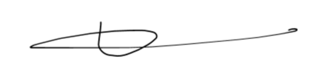

# BORROO

##  Commitment Agreement Usuarios Piloto Asignatura 

### PPL – G4
**Repositorio:** [Borroo](https://github.com/ISPP-2425-G4/borroo)

**Base de conocimientos:** [BorrooKB](https://borrookb.netlify.app/)

**Fecha:** 10/03/2025

### Miembros:
- David Blanco Mora
- Pablo Díaz Ordóñez
- Pablo Espinosa Naranjo
- Jesús Fernández Rodríguez
- Francisco Fernández Mota
- Javier García Rodríguez
- Miguel González Ortiz
- Álvaro Martín Muñoz
- Ignacio Naredo Bernardos
- Javier Nieto Vicioso
- Marco Padilla Gómez
- Miguel Palomo García
- Luis Javier Periáñez Franco
- Alexander Picón Garrote
- Santiago Rosado Raya (writer)
- Julia Sánchez Márquez
- Alejandro Sevillano Barea

---
**Nombre**: Pablo Olivencia Moreno  

**Fecha**: 12/03/2025  

**Versión del Proyecto**: 1.0  

**Grupo de trabajo**: G7

## Compromiso

Como usuario piloto del proyecto **Borroo**, me comprometo a cumplir con los siguientes requisitos y condiciones para garantizar una experiencia de prueba efectiva y contribuir a la mejora del sistema. Además, entiendo que este compromiso se enmarca en el proceso de trabajo descrito en el documento *"PilotUsers"* y me comprometo a seguir sus lineamientos.  

- **Dedicación de Tiempo**: Me comprometo a utilizar la plataforma en el periodo de prueba asignado y dedicar el tiempo necesario para evaluar su funcionamiento, reportar incidencias y proporcionar retroalimentación detallada.  

- **Participación Activa**: Me comprometo a participar en las sesiones programadas, reuniones de seguimiento y encuestas o entrevistas que el equipo del proyecto requiera para recopilar información relevante.  

- **Registro y Reporte de Incidencias**: Me comprometo a documentar cualquier error, fallo o inconveniente que detecte durante el uso del sistema y comunicarlo a través de los canales establecidos por el equipo del proyecto y rellenar el documento asignado a cada Sprint.  

- **Colaboración y Confidencialidad**: Me comprometo a mantener la confidencialidad del proyecto y no divulgar información sensible sobre su funcionamiento, características o resultados de las pruebas sin autorización previa del equipo responsable.  

- **Cumplimiento del Proceso de Trabajo**: Acepto seguir el método de trabajo establecido en el documento *"PilotUsers"*, lo que incluye la asistencia a reuniones, la entrega de **feedback** en los tiempos acordados y el uso de los canales de comunicación definidos.  

- **Uso del Feedback**: Autorizo al equipo del proyecto a utilizar mi retroalimentación y los datos recopilados durante el período de prueba para mejorar el sistema sin que ello implique una compensación adicional o derechos sobre el producto final.  

Al firmar este documento, entiendo y acepto las responsabilidades que se me han asignado y me comprometo a cumplirlas según lo establecido en este acuerdo.  

En caso de incumplimiento de los compromisos mencionados anteriormente, su evaluación será nula.  

**Firma del Usuario**

