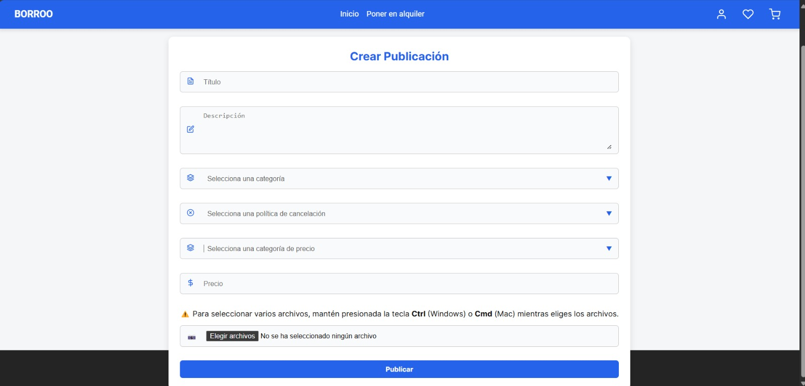
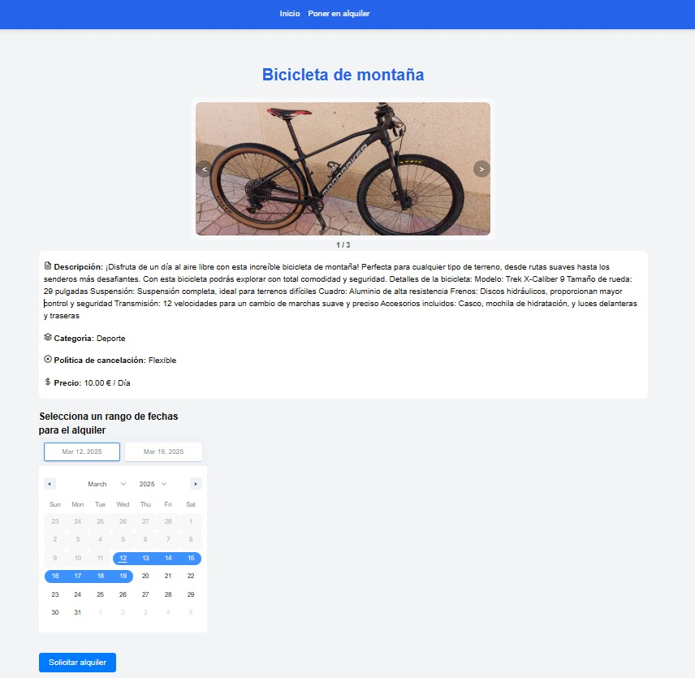
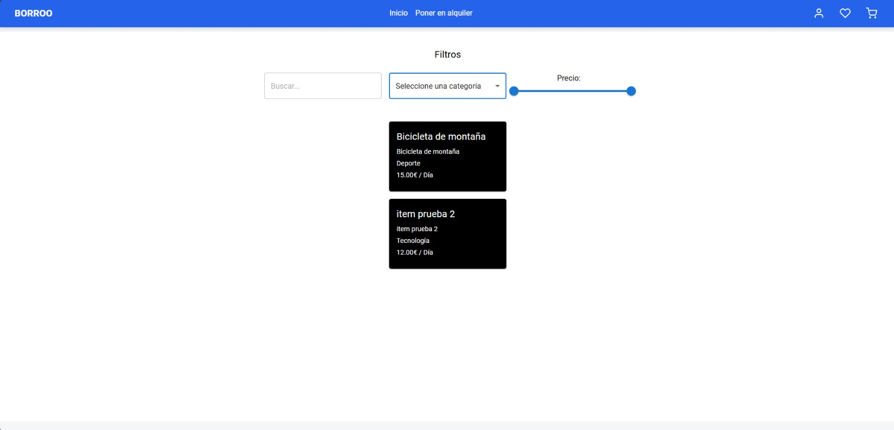
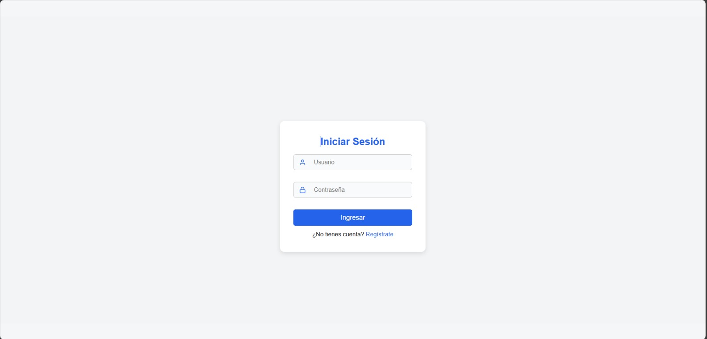
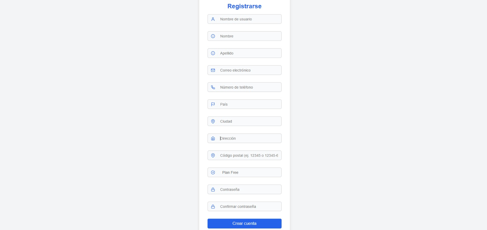

# BORROO

##  Feedback Usuarios Piloto Asignatura  

### Sprint 1 (S1) – G4
**Repositorio:** [Borroo](https://github.com/ISPP-2425-G4/borroo)
**Base de conocimientos:** [BorrooKB](https://borrookb.netlify.app/)
**Fecha:** 10/03/2025

### Miembros:
- David Blanco Mora
- Pablo Díaz Ordóñez
- Pablo Espinosa Naranjo
- Jesús Fernández Rodríguez
- Francisco Fernández Mota
- Javier García Rodríguez
- Miguel González Ortiz
- Álvaro Martín Muñoz
- Ignacio Naredo Bernardos
- Javier Nieto Vicioso
- Marco Padilla Gómez
- Miguel Palomo García
- Luis Javier Periáñez Franco
- Alexander Picón Garrote
- Santiago Rosado Raya (writer)
- Julia Sánchez Márquez
- Alejandro Sevillano Barea

---

## **Cómo rellenar el documento:**
En este documento se tendrán que rellenar los campos marcados con la información que se pide.

- **Nombre del usuario piloto:** Karim Youssafi Benichikh  
- **Fecha en la que se recibió el documento (dd/mm):** 12/03/2025 
- **Fecha de envío del documento (dd/mm):** 13/03/2025  
- **Tiempo invertido:** 2h y 30 minutos (https://app.clockify.me/shared/67d25752ef0d12419bbf2f6a)

---

## **Funcionalidades**
Como estamos teniendo problemas con el despliegue, no hemos podido cumplir con la fecha establecida, por lo que se evaluará en este Sprint las pantallas con algunas de sus funcionalidades.

En cada funcionalidad se encuentran unas capturas de pantalla de cómo va desarrollándose el sistema para que podáis poner vuestros comentarios debajo.

### **Puesta en alquiler**

_(Pantalla de puesta en alquiler de un objeto)_

A esta pantalla se accede clicando en **"Poner en alquiler"**, botón que se encuentra en la navbar.

Aquí se pide:
- Título de la publicación.
- Descripción de la publicación.
- Categoría a la que pertenece el objeto dentro de las que tenemos asignadas.
- La política de cancelación del alquiler.
- Una categoría del precio si quieres ponerlo en alquiler por horas, días, semanas o meses.
- Precio del producto, dependiendo de lo puesto en categoría del precio.
- Subir fotos del producto para que la gente pueda verlo.

**Comentarios:**
<u>Aspectos Positivos:</u>
• La estructura de la pantalla es clara y fácil de entender además que los campos están bien organizados y se incluye todos los datos relevantes para un anuncio de alquiler como el título, la descripción, precio, imagen del producto... etc. 
• Además de indicar una breve guía para seleccionar varios archivos para facilitar al usuario el subir las imágenes. 

<u>Aspectos a mejorar:</u>
• No hay ninguna indicación de que campos son obligatorios o no, (no tengo claro si todos los campos son obligatorios o no, no sé si podría subir un producto sin ninguna imagen, por ejemplo). 
• (esto no lo tengo claro si esta) Validaciones en tiempo real y que se resalte en rojo si se meten datos no válidos. 
• El precio sale en dólares, no tengo claro si es porque la aplicación es dedicada solo para ese tipo de moneda o si se consideran otros tipos como el euro, en dicho caso, estaría bien poder seleccionar el tipo de moneda según en que región se alquile el producto. 
• Para el título y la descripción estaría bien un contador de caracteres donde se vean los caracteres máximos que se puedan escribir en cada uno de dichos campos. 
• El botón de “publicar” se ve activo sin conocer si se han llenado los campos necesarios (sería mejor que saliera en gris y que no dejase publicar hasta que toda la información obligatoria este presente, es decir, mantenerlo deshabilitado hasta que todos los campos obligatorios estén completados). 
• No se especifica un tamaño máximo de archivo permitido ni el formato aceptado (jpg, png etc.). 
• Poder previsualizar el anuncio antes de publicar, para que los usuarios puedan ver cómo quedará su publicación antes de enviarlo.

---

### **Solicitud de alquiler**

_(Pantalla para solicitar un alquiler)_

A esta pantalla se accede clicando en un anuncio publicado.

En esta pantalla se puede observar el anuncio de una bicicleta de montaña con todos los detalles sobre el alquiler. También nos encontramos un calendario interactivo donde poder elegir las fechas por las que queremos alquilar el objeto y solicitarlo.

**Comentarios:**
<u>Aspectos Positivos:</u>  
• La información clave está bien organizada (descripción, categoría, política de cancelación y precio), además que el uso de iconos junto a la información facilita identificar el tipo de información y la lectura. 
• El calendario es intuitivo y fácil de usar para realizar el alquiler.

<u>Aspectos a mejorar:</u> 
• Actualmente solo se muestra el precio por día, pero el usuario no sabe cuánto pagará en total tras seleccionar el intervalo de días de forma automática, estaría bien agregar por tanto un cálculo dinámico en este caso por ejemplo del costo total según en el rango de fechas seleccionado. 
• La política de cancelación pone “Flexible”, ¿a qué se refiere con eso? estaría bien que haya un apartado que explique mejor los términos de cancelación ya sea en esta ventana u otra anteriormente donde se indique por ejemplo cuantas horas antes se puede cancelar sin costos. 
• Falta de una opción para contactar al propietario, Si el usuario tiene dudas sobre el alquiler o consultar algo sobre el mismo, no hay una opción para comunicarse con el dueño del producto, podría estar bien el poder chatear por ejemplo como en Wallapop. 
• El calendario se podría mejorar si se añade por ejemplo las fechas que ya está reservado el producto (por ejemplo, asegurar que los días que está reservado aparezcan en gris o rojo). 

---

### **Motor de búsqueda**

_(Pantalla donde realizar búsquedas dentro de los productos puestos en alquiler)_

Esta es la pantalla de inicio con todos los anuncios de objetos.

Por ahora tenemos esto en cuanto al motor de búsqueda, donde podemos buscar por:
- **Categoría:** dropdown con todas las categorías.
- **Precios:** Seleccionar un rango de precios por los que buscar los objetos en alquiler.
- **Buscar:** Busca un anuncio que coincida con lo que pongas en él.

También nos encontramos anuncios como una bicicleta de montaña o un ítem de prueba.

**Comentarios:**
<u>Aspectos Positivos:</u>
• Interfaz minimalista e intuitiva, se entiende fácilmente como realizar la búsqueda y los filtros que hay, además el uso de un slider para el precio facilita bastante al usuario indicar el precio a filtrar. 

<u>Aspectos a mejorar:</u>
• Falta de un botón para aplicar filtros, no queda claro si los filtros se aplican automáticamente o si el usuario debe realizar alguna acción adicional, en este último caso, estaría bien un botón que permita realizar dichos filtros. 
• Mostrar el rango de precios seleccionado, esto con el fin de saber el rango del precio que se ha aplicado en el slider. 
• Falta de una opción para ordenar los resultados, ya que actualmente los productos parecen mostrarse sin ningún tipo de criterio u orden. 
• Mejora de las tarjetas de los productos, ya que, a pesar de tener un buen contraste, podrían ser más atractivas visualmente, también estaría bien que se mostrara al menos la imagen principal del producto para tener una visión rápida del estado de este por ejemplo entre varios de la misma categoría.

---

### **Registro e inicio de sesión de usuarios**

_(Pantalla de inicio de sesión)_  

_(Pantalla de registro)_

A estas pantallas se accede clicando en el icono de usuario que se encuentra arriba a la derecha en la navbar.

En estas pantallas nos encontramos toda la información que tiene que aportar cada usuario de la aplicación para poder crearse una cuenta. Es importante saber la dirección de los usuarios ya que se necesita un sitio para establecer un punto de encuentro si la entrega del producto es en mano.

**Comentarios:**
<u>Aspectos Positivos:</u>  
• Diseño simple y claro, es intuitivo y fácil de entender a la hora de rellenar todos los campos, además el uso de iconos en los campos facilita su lectura y comprensión. 

<u>Aspectos a mejorar:</u>
• No hay una opción de recuperación de contraseña, en caso de que un usuario olvide su contraseña no existe una opción para restablecerla, estaría bien añadir un enlace como “¿Olvidaste tu contraseña?”. 
• Posibilidad de mostrar la contraseña encriptada, para facilitar el asegurar que se ha escrito bien la contraseña por parte del usuario. 
• Como comenté en la “puesta en alquiler” no hay ninguna indicación de que campos son obligatorios o no y si hay (esto tampoco sé si esta) validaciones en tiempo real y que se resalte en rojo por ejemplo si no son válidos. 
• El botón de “crear cuenta” se ve activo sin conocer si se han llenado los campos necesarios, podría mejorarse si se mostrara en gris y solo se pusiera en azul por ejemplo cuando se rellenen todos los campos obligatorios. 

---

## **Otros comentarios**
• Las capturas están hechas desde una “página web”, pero estaría bien saber como se ve en móvil, por ejemplo, ya que la mayoría de los usuarios entiendo que usarían la aplicación desde un dispositivo móvil. 
• Mejora en la navegación, ahora mismo existe “inicio” y “poner en alquiler” por lo que vi en las imágenes, aunque yo podría más secciones como “perfil”, “loging”, “logout” entre otros para facilitar la navegabilidad al usuario. 
• Iteracción entre usuarios, actualmente no parece haber una opción para que los usuarios interactúen entre sí, estaría bien un chat a lo Wallapop como mencione antes, especialmente para cuando se quiera hacer un alquiler para contactar con el propietario. 
• Métodos de pago y seguridad, no se menciona ni se ve ninguna ventana de cómo se gestionarán los pagos dentro de la plataforma, entiendo que aun esta en desarrollo, pero lo pongo por si acaso para tener en cuenta. 
• Notificaciones y alertas, estaría bien añadir sistemas de notificación y alertas cuando un usuario te contacte para un alquiler. 
• Sistema de reseñas con estrellas, al igual que Wallapop, estaría bien poder ver los perfiles de los usuarios a quien alquilas y viceversa para poder ver si son de fiar y haya una puntuación/valoración entre usuarios con estrellas y se pueda dar feedback tanto del que solicita el alquiler como el que lo promociona. 
• Finalmente estaría bien contemplar un sistema de soporte y ayuda para los usuarios, con sección visible de preguntas frecuentes o contacto con soporte. Por terminar estaría bien añadir también el logo de la empresa en el navbar junto a “BORRO” como mejora visual.

---

Muchas gracias, vuestra opinión nos importa. 😉