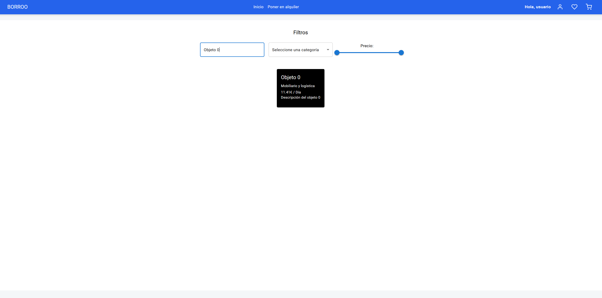

# BORROO

Revisión

Sprint 1 – G4

Repositorio: [https://github.com/ISPP-2425-G4/borroo](https://github.com/ISPP-2425-G4/borroo)

11/03/2025

Miembros:

-   David Blanco Mora
-   Pablo Díaz Ordóñez
-   Pablo Espinosa Naranjo
-   Jesús Fernández Rodríguez
-   Francisco Fernández Mota
-   Javier García Rodríguez
-   Miguel González Ortiz
-   Álvaro Martín Muñoz
-   Ignacio Naredo Bernardos
-   Javier Nieto Vicioso
-   Marco Padilla Gómez
-   Miguel Palomo García
-   Luis Javier Periáñez Franco
-   Alexander Picón Garrote
-   Santiago Rosado Raya
-   Julia Sánchez Márquez
-   Alejandro Sevillano Barea

----------------

## 1.  Introducción
    

Este documento  proporciona  una  guía  detallada para la revisión del software en  todas las entregas a partir del S1. Su objetivo es garantizar que cada  entrega  incluya la documentación  necesaria para que los  revisores  puedan  evaluar  correctamente la implementación del software.

En particular, se  establecen  los  requisitos clave, como la relación entre los  casos de uso y la interacción  en  el software, los  datos  necesarios para la evaluación y la información de despliegue de la aplicación. Además, se incluyen  detalles  sobre la documentación del código  fuente, las credenciales de acceso y cualquier  otro  elemento  relevante para facilitar la revisión.

Este documento  servirá  como  referencia tanto para los  desarrolladores  como para los  revisores  durante  el  proceso de evaluación, asegurando que se cumplan  los  criterios de calidad y funcionalidad del sistema.

----------------
## 2. Casos de uso  core
### Caso 1: Inicio de sesión

1.  El usuario accede a la plataforma BORROO y selecciona la opción "Iniciar Sesión".
2.  El sistema muestra el formulario de inicio de sesión con los campos:
-   	Nombre de usuario
-   	Contraseña
3.  El usuario ingresa sus credenciales y presiona el botón "Ingresar".
4.  El sistema valida las credenciales ingresadas.
5.  Si las credenciales son correctas:
	-   El usuario es autenticado y redirigido a la página principal de la plataforma.
	-   Se muestra un mensaje de bienvenida.
	-   La sesión del usuario queda activa y puede navegar por la plataforma.

### Caso 2: Registro de usuario
1.  El usuario accede a la pantalla de Registro.
2.  El sistema muestra el formulario de registro con los siguientes campos:
	-   Nombre de usuario
	-   Nombre
	-   Apellido
	-   Correo electrónico
	-   Número de teléfono
	-   País
	-   Ciudad
	-   Dirección
	-   Código postal
	-   Plan de suscripción (Free por defecto)
	-   Contraseña
	-   Confirmación de contraseña
3.  El usuario completa el formulario con su información.
4.  El usuario presiona el botón "Crear cuenta".
5.  El sistema valida la información ingresada:
	-   Verifica que los campos requeridos no estén vacíos.
	-   Comprueba que el correo electrónico no esté registrado previamente.
	-   Valida que la contraseña cumpla con los requisitos de seguridad.
	-   Confirma que la contraseña y la confirmación coincidan.
 
6.  Si los datos son correctos:
	-   El sistema registra al usuario en la base de datos.
	-   El sistema muestra un mensaje de éxito.
	-   Se redirige al usuario a la pantalla de inicio de sesión.
	-   El usuario puede iniciar sesión con sus credenciales recién creadas.

### Caso 3: Visualización de objetos  disponibles para alquiler
1.  El usuario accede a la página principal
2.  El usuario puede ver los detalles básicos de cada objeto en la tarjeta de presentación.

### Caso 4: Visualización con filtrado de búsqueda  por  nombre, categoría y precio
1.  El usuario accede a la página principal con todos los anuncios
2.  El usuario, por medio de los distintos filtros y botones que se muestran en la zona superior de la pantalla, añade las características concretas para reducir los resultados mostrados en pantalla, siendo estos:
	-   Barra de búsqueda en función del nombre del objeto
	-   Filtrado de categoría a la que pertenece el objeto a alquilar
	-   Barra adaptable para el rango de precio declarado

### Caso 5: Visualización de detalles de un anuncio
1.  El usuario, desde la vista principal, selecciona el anuncio que le interesa
2.  Se muestra una pantalla con todos los detalles del anuncio, siendo estos:
	-   Descripción
	-   Categoría
	-   Política de cancelación
	-   Precio
	-   Usuario anunciante

### Caso 6: Solicitud de  alquiler de  objeto
1.  El usuario accede a la plataforma y navega por la página principal donde se muestran los objetos disponibles.
2.  El usuario selecciona un objeto específico para ver más detalles.
3.  El sistema muestra la información del objeto, incluyendo su precio, categoría y disponibilidad.
4.  El usuario selecciona el rango de fechas para el alquiler utilizando el calendario interactivo.
5.  El usuario presiona el botón "Solicitar alquiler".
6.  El sistema muestra un cuadro de diálogo de confirmación con las fechas seleccionadas y el precio.
7.  El usuario confirma la solicitud presionando el botón "Confirmar".

### Caso 7: Crear publicación de alquiler
1.  El usuario accede a la plataforma e inicia sesión.
2.  El usuario navega a la sección "Poner en alquiler".
3.  El sistema muestra un formulario para crear la publicación.
4.  El usuario completa los siguientes campos obligatorios:
	-   Título del objeto.
	-   Descripción del objeto.
	-   Categoría del objeto.
	-   Política de cancelación (flexible, moderada, estricta, etc.).
	-   Unidad de precio (hora, día, semana, etc.).
	-   Precio del alquiler.
	-   Opcionalmente, el usuario puede añadir imágenes del objeto.
5.  El usuario presiona el botón "Publicar".

### Caso 8: Editar  publicación de alquiler
1.  El usuario selecciona la publicación que desea editar.
2.  El usuario presiona el botón “editar”
3.  El sistema muestra el formulario con los datos actuales del objeto publicado.
4.  El usuario puede modificar los siguientes campos:
	-   Nombre del objeto.
	-   Descripción del objeto.
	-   Categoría.
	-   Política de cancelación.
	-   Unidad de tiempo para el precio (hora, día, semana, etc.)
	-   Precio del alquiler.
	-   Imagen del objeto (opcional).
5.  El usuario presiona el botón "Actualizar".

### Caso 9: Eliminar objeto de alquiler
1.  El usuario selecciona el anuncio del objeto que desea eliminar
2.  El usuario presiona el botón “Eliminar”
3.  Se indica por medio de un mensaje al usuario si está seguro de querer eliminar el anuncio del objeto
4.  El usuario presiona el botón de “Aceptar”
5.  Se muestra un mensaje de que se ha eliminado correctamente

## 3. Datos necesarios para la revisión
**Los datos necesarios para la revisión son**: 

URL landing page: https://sites.google.com/view/borroo/

Credenciales usuario:  

	- Usuario: User1 / Password: 123 

	- Usuario: User2 / Password: 123 

 Administrador (acceder desde ruta https://backend-dot-ispp-2425-g4.ew.r.appspot.com/admin):

 	- Administrador: admin_ispp / B0rr0o2025ISPP
  	 (correo por si fuese necesario: borroohelp@gmail.com)
 

URL deployment platform: https://frontend-dot-ispp-2425-g4.ew.r.appspot.com/ 

URL Github Repository: https://github.com/ISPP-2425-G4/borroo 

URL y credenciales del “time tracking tool”: Desde clockify:

	- Credenciales: borroohelp@gmail.com / B0rr0o2025ISPP
 	 (Para doble verificación, usar mismo correo y contraseña en gmail)

Potential Requirements: Uso de internet para aplicacion desplegada, descrito en readme de git para aplicacion local 

Enlace video demo:  https://youtu.be/dlp_72Nuzr0
