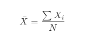

# BORROO

## AI Usage

### Sprint 3 – G4
**Repositorio:** [Borroo](https://github.com/ISPP-2425-G4/borroo)  
**Base de conocimientos:** [BorrooKB](https://borrookb.netlify.app/)  

Fecha: 28/03/2025  

**Miembros:**  
- David Blanco Mora  
- Pablo Díaz Ordóñez  
- Pablo Espinosa Naranjo  
- Jesús Fernández Rodríguez  
- Francisco Fernández Mota  
- Javier García Rodríguez  
- Miguel González Ortiz  
- Álvaro Martín Muñoz  
- Ignacio Naredo Bernardos  
- Javier Nieto Vicioso  
- Marco Padilla Gómez  
- Miguel Palomo García  
- Luis Javier Periáñez Franco  
- Alexander Picón Garrote  
- Santiago Rosado Raya  
- Julia Sánchez Márquez  
- Alejandro Sevillano Barea  

---

## **Histórico de modificaciones**

| Fecha      | Versión | Realizada por   | Descripción de los cambios |
| ---------- | ------- | --------------- | -------------------------- |
| 28-03-2025 | v1.0    | Javier García Rodríguez | Creación del documento |
---

## 1. Introducción

Este documento describe las herramientas de inteligencia artificial usadas en el Sprint 2 de la asignatura de Ingeniería del Sofware y Práctica Profesional. Tiene como objetivo definir las políticas para el uso de estas herramientas durante el desarrollo del proyecto. Se mencionarán las herramientas usadas, sus procedimientos, algunos prompts enviados, el rendimiento ofrecido, y las alucionaciones 

## 2. Herramientas IA y su proposito

La integración de la IA ha sido clave para reducir los tiempos de tareas, optimizándolas, resolución de errores, y más. Principalmente, las herramientas usadas han sido las siguientes:

- ChatGPT (https://chatgpt.com/)
- Github Copilot (Integrado con una extensión en Visual Studio Code)
- Claude (https://claude.ai/)

A continuación, se detallan los distintos usos dados, detallando el propósito específico.

### 2.1. Generación de documentación

Las herramientas de IA han sido utilizadas para el desarrollo y optimización de documentación técnica, facilitando la redacción de estos. La IA permite generar descripciones claras y detalladas, asegurando coherencia y calidad en la documentación producida. Además, ha sido útil para la corrección y optimización del texto, mejorando la claridad y eliminando posibles errores gramaticales o inconsistencias en la redacción. Con su uso, se ha logrado mejorar la velocidad de producción documental sin comprometer la precisión y profundidad del contenido. Principalmente, se ha usado ChatGPT.

### 2.2. Generación de código para backend y frontend

El uso de IA en la generación de código ha permitido acelerar el desarrollo tanto en el backend como en el frontend. Herramientas como GitHub Copilot han sugerido fragmentos de código optimizados, reduciendo el tiempo necesario para escribir funciones repetitivas y facilitando la implementación de patrones de diseño adecuados. En el frontend, se ha aprovechado para generar componentes reutilizables y estilos coherentes con la identidad del proyecto. En el backend, la IA ha ayudado a estructurar controladores, servicios y modelos, asegurando una mejor organización del código y reduciendo errores sintácticos o conceptuales desde las primeras fases del desarrollo.

### 2.3. Resolución y aclaración de errores

Una de las aplicaciones más relevantes de la IA en el proyecto ha sido la identificación y solución de errores en el código. A través del análisis de mensajes de error y logs del sistema, las herramientas de IA han proporcionado sugerencias precisas sobre posibles soluciones, reduciendo el tiempo dedicado a la depuración. También han sido útiles para explicar conceptos técnicos complejos, permitiendo una mejor comprensión de errores difíciles de interpretar. Esto ha mejorado la eficiencia del equipo al resolver problemas de manera más rápida y efectiva, disminuyendo el impacto de errores en el desarrollo continuo del software.

## 3. Registro y Análisis de Uso

Se han desarrollado 2 tablas, una para poder documentar de una forma eficiente el registro de los chats con las inteligencias artificiales (principalmente, ChatGPT), y otra tabla para poder analizar cada chat y valorar la eficiencia de estos. Se adjuntan algunas filas del registro del uso y su análisis correspondiente.

| ID   | Uso (Descripción)       | Nombre del Miembro | Fecha       | Enlace al Chat |
|------|-------------------------|--------------------|------------|---------------|
| 001  | Información sobre IA generativa para vídeos   | Javier García Rodríguez       | 03/04/2025 | [Ver chat](https://chatgpt.com/share/67ef3261-fa0c-8001-9856-d29d051e270e) |
| 002  | Resolución de bugs en código  | Javier García Rodríguez       | 03/04/2025 | [Ver chat](https://chatgpt.com/share/67ef32e4-70fc-8001-8a36-78e209045a65) |

https://chatgpt.com/share/67ef32e4-70fc-8001-8a36-78e209045a65
------------------------------------------------------------------

| ID   | Tipo de prompt          | Útil (Sí/No) | Tiempo Ahorrado |
|------|---------------------------|--------------|-----------------|
| 001  | Solicitud de información     | Sí           | 40 min          |
| 002  | Detección de bugs     | Sí           | 40 min          |

## 4. Alucinaciones de la IA

Para calcular el porcentaje de alucinaciones de las inteligencias artificiales usadas, se ha determinado por generar una tabla en la que se determina, por cada miembro, el número de usos, y el porcentaje de alucinaciones recibido.

| Desarrollador | Usos | % Alucinaciones |
|----|------|------------|
| 1  |   6  | 16%  |

### Cálculo de las alucinaciones por IA

Para calcular el porcentaje de alucinaciones de las inteligencias artificiales usadas, se ha determinado por obtener el porcentaje medio de alucinaciones, calculando la media aritmética de los valores registrados en la columna "% Alucinaciones". La fórmula utilizada es:

Donde:
- Xi representa cada uno de los valores de porcentaje de alucinaciones.
- N es el número total de desarrolladores.

Aplicando la fórmula, el porcentaje medio de alucinaciones es:

### Conclusión
