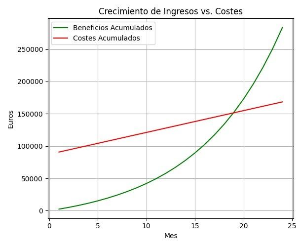

# BORROO

  

## TCO

### Sprint 3 – G4
**Repositorio:** [Borroo](https://github.com/ISPP-2425-G4/borroo)  
**Base de conocimientos:** [BorrooKB](https://borrookb.netlify.app/)  

Fecha: 28/03/2025  

**Miembros:**  
- David Blanco Mora  
- Pablo Díaz Ordóñez  
- Pablo Espinosa Naranjo  
- Jesús Fernández Rodríguez  
- Francisco Fernández Mota  
- Javier García Rodríguez  
- Miguel González Ortiz  
- Álvaro Martín Muñoz  
- Ignacio Naredo Bernardos  
- Javier Nieto Vicioso  
- Marco Padilla Gómez  
- Miguel Palomo García  
- Luis Javier Periáñez Franco  
- Alexander Picón Garrote  
- Santiago Rosado Raya  
- Julia Sánchez Márquez  
- Alejandro Sevillano Barea  

---

## **Histórico de modificaciones**

| Fecha      | Versión | Realizada por   | Descripción de los cambios |
| ---------- | ------- | --------------- | -------------------------- |
| 03-04-2025 | v1.0    | Miguel Palomo García | Reestimaciones hechas respecto al S2 |
| 07-04-2025 | v1.1    |Javier García Rodríguez | Traslado a markdown |

---

## Índice

1. [TCO](#1-tco)  
    1.1 [Desglose de los Componentes del TCO](#11-desglose-de-los-componentes-del-tco)  
    1.2 [Cálculo del TCO para 3 Años](#12-cálculo-del-tco-para-3-años)  
2. [Amortización (ROI)](#2-amortización-roi)  
    2.1 [Información sobre comisiones y suscripciones](#21-información-sobre-comisiones-y-suscripciones)  
        - 2.1.1 [Comisiones de usuarios](#211-comisiones-de-usuarios)  
        - 2.1.2 [Suscripciones de usuarios](#212-suscripciones-de-usuarios) 
    2.2 [Cálculo de amortización](#22-cálculo-de-amortización)  
        - 2.2.1 [Costes y escenarios](#221-costes-y-escenarios) 
        - 2.2.2 [Beneficio optimista y pesimista](#222-beneficio-optimista-y-pesimista)  
        - 2.2.3 [Escenario esperado](#223-escenario-esperado)  
    2.3 [Gráficos de evolución](#23-gráficos-de-evolución)
    2.4 [Resumen final](#24-resumen-final)  

## 1. TCO

El **Total Cost of Ownership (TCO)** representa el costo total de propiedad de un producto, sistema o proyecto a lo largo de un período determinado, en este caso, **3 años**. Incluye tanto los **costes iniciales** como los **costes recurrentes** durante la operación del sistema.

### 1.1 Desglose de los Componentes del TCO

1. Coste Inicial (€): Son los costes que se generan en la fase de desarrollo y lanzamiento del proyecto. Estos gastos se incurren una sola vez al inicio.

2. Coste Anual (€): Son los costes que se repiten anualmente a lo largo de la operación del sistema

| Concepto                  | Coste Inicial (€) | Coste Anual (€) | Explicación |
|--------------------------|-------------------|------------------|-------------|
| Desarrollo y Diseño      | 64.390,20         | 0                | Coste de diseño y desarrollo del sistema, incluyendo programadores, diseñadores y  pruebas |
| Licencias y Herramientas | 3.000             | 2.000            | Coste de software de terceros, herramientas de desarrollo, licencias de plataformas y herramientas necesarias para el funcionamiento del proyecto. |
| Hosting y Servidores     | 2.000             | 8.000            | Coste del alojamiento web y servidores necesarios para mantener la aplicación activa en Google App Engine. |
| Dominio y Publicación    | 50                | 30               | Registro del dominio web y renovación anual del dominio. |
| Marketing de Lanzamiento| 10.000            | 5.000            | Coste de estrategias de marketing iniciales,  publicitarias, y mantenimiento de campañas anuales para atraer usuarios. |
| Mantenimiento y Actualizaciones | 0         | 20.000           | Coste de mantenimiento correctivo y evolutivo para mejoras, actualizaciones y corrección de errores a lo largo del tiempo. |
| Soporte y Atención al Cliente | 0            | 10.000           | Coste de asistencia al usuario, incluyendo personal de soporte, sistemas de atención al cliente, y plataformas para gestionar las consultas. |

**Desglose gasto en desarrollo y diseño:**

- Horas totales por persona: 14 semanas × 10 horas/semana = 140 horas
- Total de horas por rol: Número de personas × 140 horas
- Costo total por rol: Total de horas por rol × Tarifa junior sin IVA

El costo estimado considerando 14 semanas de trabajo con 10 horas semanales por persona sin IVA es el siguiente:
- Jefes de proyecto / Coordinadores (3 personas): 9,450.00 €
- Analistas programadores (3 personas): 13,910.40 €
- Testers de calidad (QA) (3 personas): 9,983.40 €
- Programadores Web (8 personas): 31,046.40 €

Costo total de la fase de desarrollo y diseño: 64,390.20

### 1.2 Cálculo del TCO para 3 Años

El TCO se calcula sumando el coste inicial y el coste anual multiplicado por la cantidad de años considerados:

TCO = Coste Inicial + (Coste Anual × 3)

Sustituyendo los valores:

TCO = 79.440,20 + (45.030 × 3)
TCO = 79.440,20 + 135.090
TCO = 214.530,20 €

Por lo tanto, el TCO para 3 años del proyecto es 214.530,20 €. Este cálculo proporciona una visión clara del coste total de propiedad, permitiendo tomar decisiones estratégicas sobre inversión, mantenimiento y rentabilidad del sistema.

## 2. Amortización (ROI)

Para calcular la amortización del proyecto, se ha considerado el crecimiento progresivo de usuarios debido a estrategias de marketing y adopción gradual de la aplicación.

### 2.1 Información sobre comisiones y suscripciones

#### 2.1.1 Comisiones de usuarios

Los usuarios pagan una comisión del 15% sobre el precio de alquiler de los productos. Según los datos recopilados, la frecuencia de alquiler de los usuarios se distribuye de la siguiente manera:

- 78% de los usuarios alquilan 1 vez al mes o menos.
- 15,3% de los usuarios alquilan 2-3 veces al mes.
- 7% de los usuarios alquilan más de 3 veces al mes.
- 
#### 2.1.2 Suscripciones de usuarios

El 66% de los usuarios están dispuestos a pagar una suscripción de 5€ mensuales. 

### 2.2 Cálculo de amortización

A medida que el número de usuarios crece, el beneficio mensual se incrementa hasta alcanzar el punto de equilibrio. Esperamos 500 usuarios iniciales debido a las campañas de marketing, además estimamos un 12% de incremento mensual en los usuarios. 

- Usuarios iniciales: 500  
- Incremento mensual estimado: 12%

#### 2.2.1 Costes y escenarios

Reserva de contingencia: Se añade un 10% sobre la inversión inicial para cubrir imprevistos. 

- Inversión inicial base: 79.440,20 € 
- Reserva de contingencia (10%): 7.944,02 € 
- Inversión total con contingencia: 87.384,22 € 

Coste mensual esperado:  3.752,50 €/mes. 

Coste mensual optimista: Se reduce en un 10% debido a eficiencias operativas. 

#### 2.2.2 Beneficio optimista y pesimista

##### Escenario optimista (+20% usuarios)

- Tiempo de amortización: 11 meses 
- Usuarios en el tiempo de amortización: 2149 
- Incremento mensual de usuarios:  33% 
- Ingresos acumulados: 160246,77 € 
- Coste mensual: 3.377,25 € 
- Gastos acumulados: 124533,97 €  

##### Escenario pesimista (-20% usuarios)

- Tiempo de amortización: 34 meses 
- Usuarios en el tiempo de amortización: 2502 
- Incremento mensual de usuarios:  5% 
- Ingresos acumulados: 204160,70€ 
- Coste mensual: 3.377,25 € 
- Gastos acumulados: 202210,72 € 

#### 2.2.3 Escenario esperado

Aproximando una tasa de crecimiento mensual de los usuarios de un 12% en cada mes tenemos la siguiente tabla para los datos esperados.

| Mes | Usuarios Totales | Beneficios acumulads (€) | Costes acumulados (€)       |
|-----|------------------|----------------|------------------|
| 1   | 500              | 2.400          | 90.761,47        |
| 6   | 881              | 19.476,45      | 107.647,72       |
| 12  | 1739             | 57.919,52      | 127.991,22       |
| 18  | 3845             | 133.799,32     | 148.174,72       |
| 19  | 4306             | 152.255,23     | 151.551,97       |
| 24  | 6776             | 283.572,58     | 168.438,22       |

---

### 2.3 Gráficos de evolución

- **Gráfico 1:** Crecimiento de usuarios y empresas
  

- **Gráfico 2:** Evolución de ingresos mensuales esperados respecto a costes  
  

- **Gráfico 3:**  Evolución de ingresos esperados, pesimista y optimista respecto a costes  
  

### 2.4 Resumen final

- Tiempo de amortización base: 19 meses (1 año y 7 meses).
- Tiempo de amortización optimista: 11 meses.
- Tiempo de amortización pesimista: 34 meses.

Este análisis considera diferentes escenarios para evaluar la rentabilidad y
mitigación de riesgos del proyecto.
