# BORROO

Revisión

WPL – G4

Repositorio: [https://github.com/ISPP-2425-G4/borroo](https://github.com/ISPP-2425-G4/borroo)

22/05/2025

Miembros:

-   David Blanco Mora
-   Pablo Díaz Ordóñez
-   Pablo Espinosa Naranjo
-   Jesús Fernández Rodríguez
-   Francisco Fernández Mota
-   Javier García Rodríguez
-   Miguel González Ortiz
-   Álvaro Martín Muñoz
-   Ignacio Naredo Bernardos
-   Javier Nieto Vicioso
-   Marco Padilla Gómez
-   Miguel Palomo García
-   Luis Javier Periáñez Franco
-   Alexander Picón Garrote
-   Santiago Rosado Raya
-   Julia Sánchez Márquez
-   Alejandro Sevillano Barea

----------------
## **Histórico de modificaciones**

| Fecha      | Versión | Realizada por   | Descripción de los cambios |
| ---------- | ------- | --------------- | -------------------------- |
| 22-05-2025 | v1.0    | Pablo Espinosa Naranjo // Ignacio Naredo Bernardos | Creación del documento |

----------------

## 1.  Introducción
    

Este documento  proporciona  una  guía  detallada para la revisión del software en  todas las entregas a partir del S1. Su objetivo es garantizar que cada  entrega  incluya la documentación  necesaria para que los  revisores  puedan  evaluar  correctamente la implementación del software.

En particular, se  establecen  los  requisitos clave, como la relación entre los  casos de uso y la interacción  en  el software, los  datos  necesarios para la evaluación y la información de despliegue de la aplicación. Además, se incluyen  detalles  sobre la documentación del código  fuente, las credenciales de acceso y cualquier  otro  elemento  relevante para facilitar la revisión.

Este documento  servirá  como  referencia tanto para los  desarrolladores  como para los  revisores  durante  el  proceso de evaluación, asegurando que se cumplan  los  criterios de calidad y funcionalidad del sistema.

----------------
## 2. Casos de uso  core

### Caso 1: Inicio de sesión

1.  El usuario accede a la plataforma BORROO y selecciona la opción "Iniciar Sesión".
2.  El sistema muestra el formulario de inicio de sesión con los campos:
-   	Nombre de usuario
-   	Contraseña
3.  El usuario ingresa sus credenciales y presiona el botón "Ingresar".
4.  El sistema valida las credenciales ingresadas.
5.  Si las credenciales son correctas:
    -   El usuario es autenticado y redirigido a la página principal de la plataforma.
    -   Se muestra un mensaje de bienvenida.
    -   La sesión del usuario queda activa y puede navegar por la plataforma.
6. Si el usuario no recuerda su contraseña, presiona el botón "No recuerdo mi contraseña"
7. El usuario introduce su correo electronico
8. Le llega un aviso al correo, al aceptarlo se le pide que ingrese su nueva contraseña
9. El usuario recupera el acceso a su cuenta con la nueva contraseña introducida

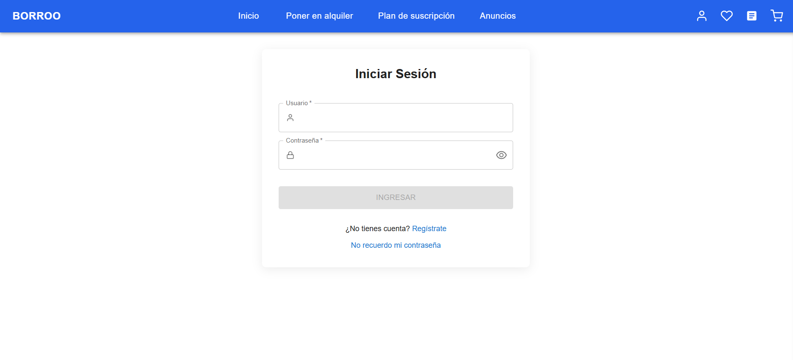
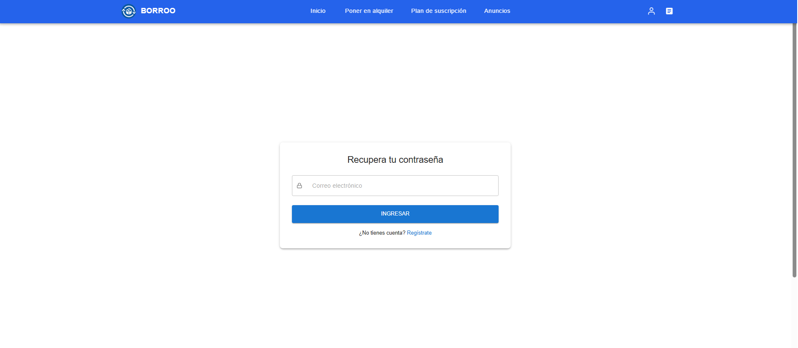
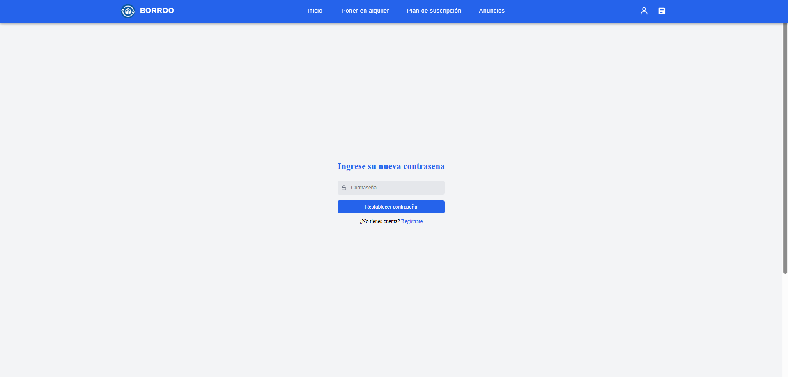

### Caso 2: Registro de usuario
1.  El usuario accede a la pantalla de Registro.
2.  El sistema muestra el formulario de registro con los siguientes campos:
    -   Nombre de usuario
    -   Nombre
    -   Apellido
    -   Correo electrónico
    -   Contraseña
    -   Confirmación de contraseña
    -	NIF (Si seleccionas opción de empresa)
3.  El usuario completa el formulario con su información.
4.  El usuario presiona el botón "Crear cuenta".
5.  El sistema valida la información ingresada:
    -   Verifica que los campos requeridos no estén vacíos.
    -   Comprueba que el correo electrónico no esté registrado previamente.
    -   Valida que la contraseña cumpla con los requisitos de seguridad.
    -   Confirma que la contraseña y la confirmación coincidan.
 
6.  Si los datos son correctos:
    -   El sistema registra al usuario en la base de datos.
    -   El sistema muestra un mensaje de éxito.
    -   Se redirige al usuario a la pantalla de inicio de sesión.
    -   El usuario puede iniciar sesión con sus credenciales recién creadas.
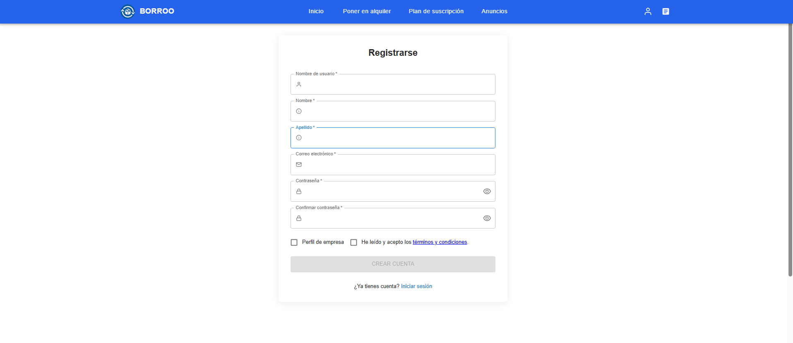

### Caso 3: Ver perfil de usuario propio
1. El usuario debe loggearse
2. El usuario presiona el boton "Mi perfil"
3. Se muestran los siguientes datos del usuario:
    - Email
    - Telefono
    - Dirección
    - C.Postal
    - Pais
    - Ciudad
    - Plan de suscripción
    - Información sobre si esta identificado
    - Articulos en alquiler
    - Articulos en borrador (Sin publicar)
    - Valoraciones recibidas

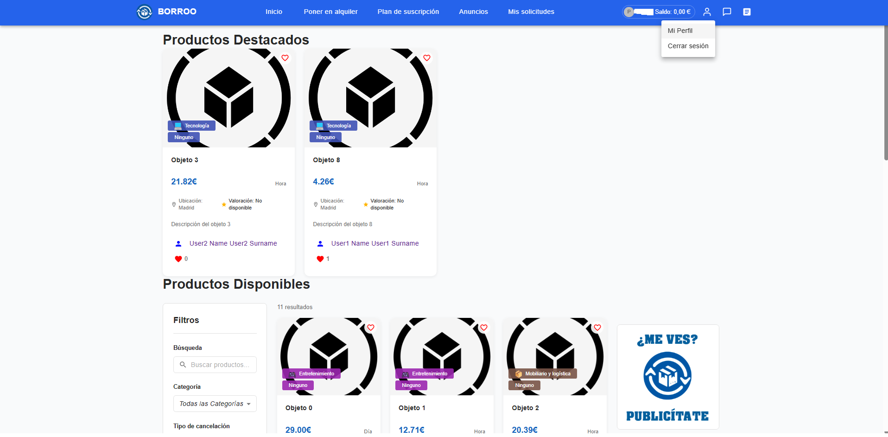
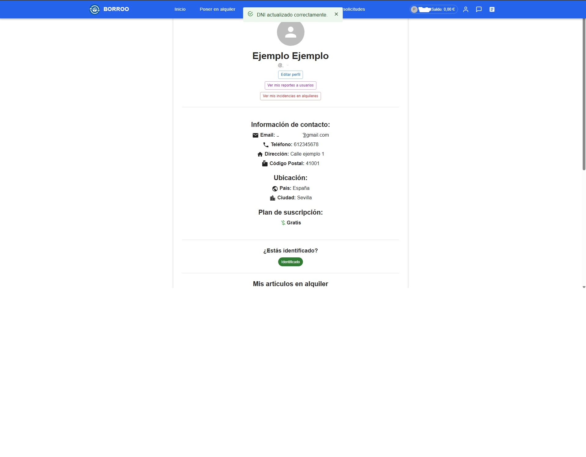

### Caso 4: Editar los datos de tu perfil
1. El usuario debe loggearse
2. El usuario presiona el boton "Mi perfil"
3. El usuario pulsa la opción "Editar perfil"
4. EL usuario rellena el formulario
5. Adicionalmente si no lo hizo anteriormente, el usuario añade su DNI

(Si los campos de los pasos 4 o 5 no han sido rellenados, el usuario no puede poner en alquiler ningun objeto ni solicitarlos)

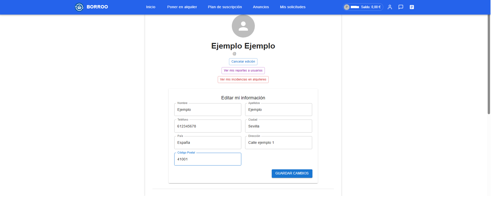
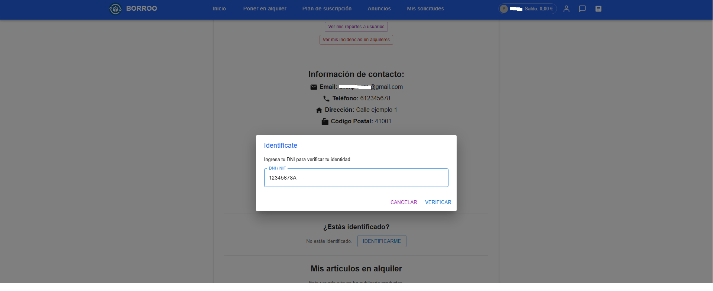

### Caso 5: Ver perfil de otro usuario
1. El usuario debe presionar cualquiera de los botones disponibles para acceder a la vista de otro usuario (Ej: Nombre de usuario en la vista principal en cada objeto, nombre en detalles del objeto, nombre en anuncios)
2. El usuario ve una vista de los perfiles de otro usuario (solo datos principales)

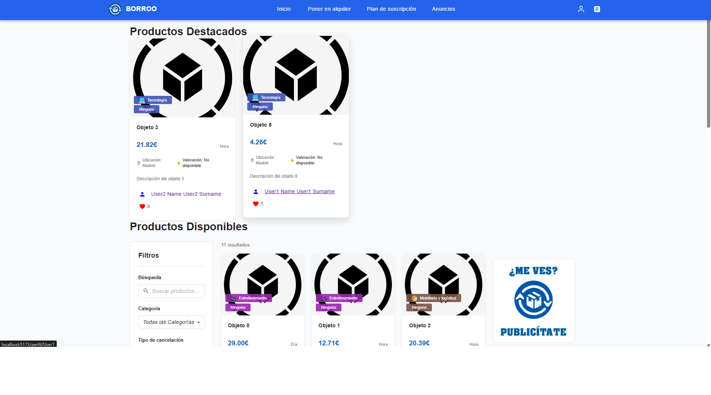
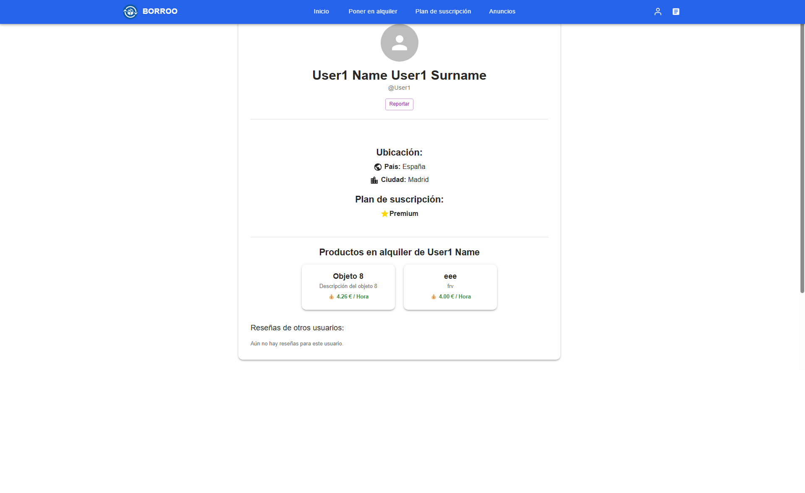

### Caso 6: Visualización de objetos disponibles para alquiler

1.  El usuario accede a la página principal
2.  El usuario puede ver los detalles básicos de cada objeto en la tarjeta de presentación.
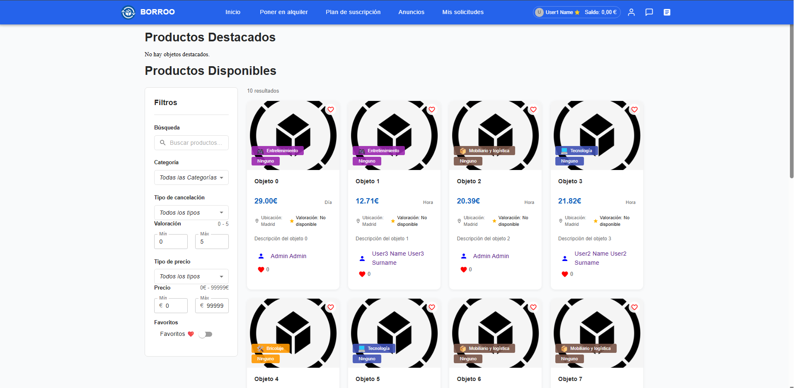

### Caso 7: Visualización con filtrado
1.  El usuario accede a la página principal con todos los anuncios
2.  El usuario, por medio de los distintos filtros y botones que se muestran en el lateral de la pantalla, añade las características concretas para reducir los resultados mostrados en pantalla, siendo estos:
    -   Barra de búsqueda en función del nombre del objeto
    -   Filtrado de categoría y subcategoría a la que pertenece el objeto a alquilar
    -   Barra adaptable para el rango de precio declarado
    -	Tipo de cancelación del alquiler
    -	Valoración
    -	Tipo de precio del alquiler (Hora, dia, mes)
    -	Precio
    -	Favoritos

3.	El usuario puede eliminar los filtros de uno en uno con los botones situados en la parte superior a continuación de "Filtros aplicados: ", o todos con el boton "Limpiar todo".
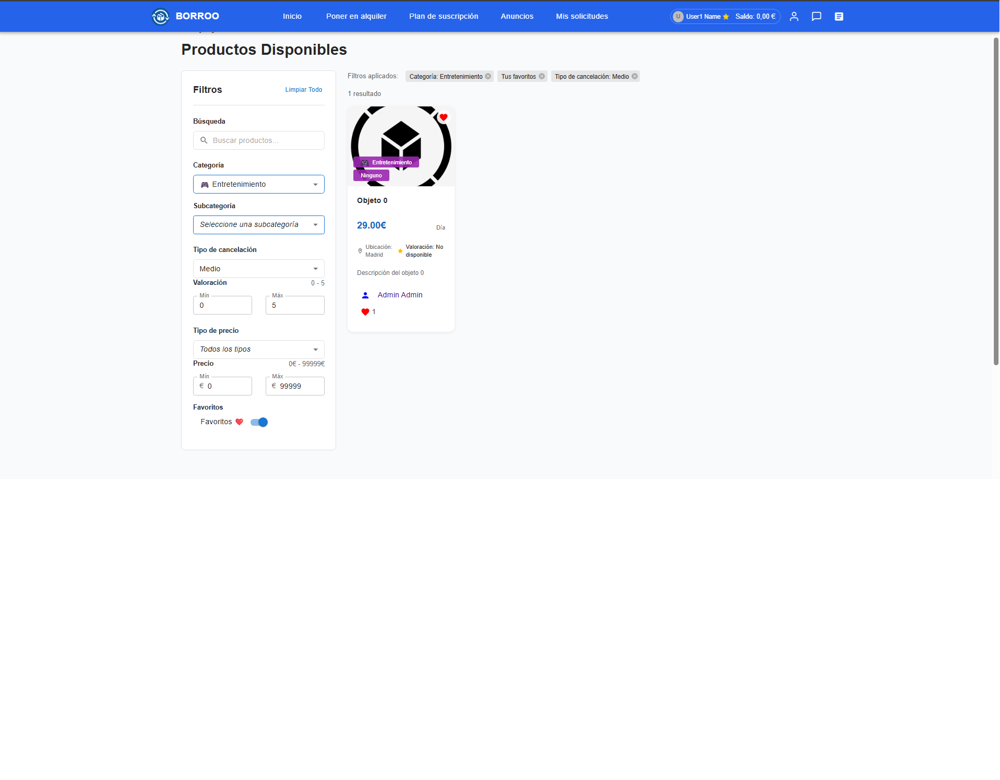

### Caso 8: Ver y añadir objetos a favoritos
1. El usuario debe loggearse
2. El usuario puede ver aquellos objetos que ha guardado en favoritos con filtro "Favoritos"
3. El usuario puede añadir objetos a favoritos pulsando el botón correspondiente en la pantalla principal o en los detalles del objeto
4. Si el objeto ha sido guardado por varios usuarios en favoritos, hay un mensaje indicativo en los detalles del objeto

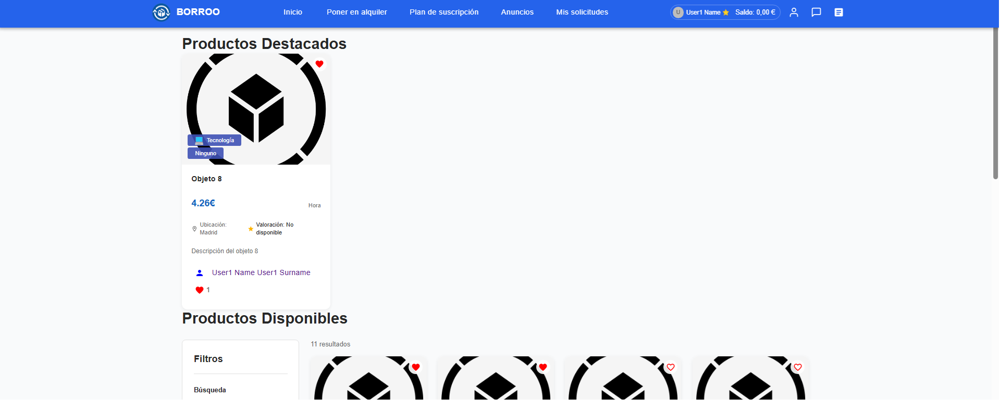
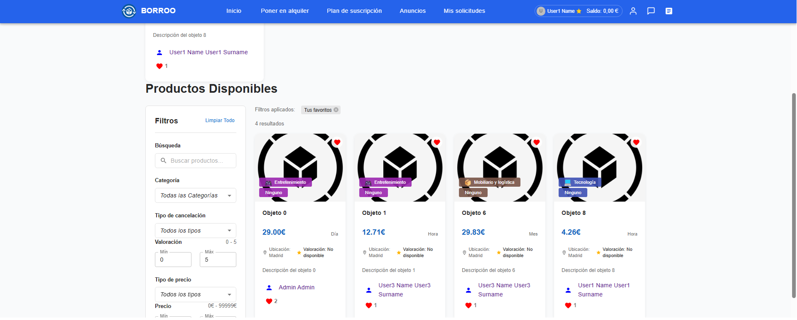
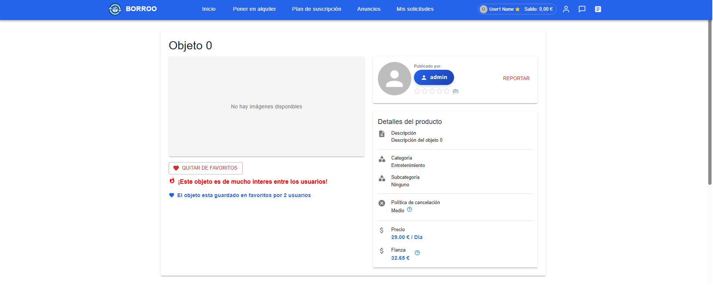

### Caso 9: Visualización de detalles de un anuncio de un objeto
1.  El usuario, desde la vista principal, selecciona el anuncio que le interesa
2.  Se muestra una pantalla con todos los detalles del anuncio, siendo estos:
    -   Descripción
    -   Categoría
    -	Subcategoría
    -   Política de cancelación
    -   Precio
    -   Usuario anunciante
    -	Veces que el objeto fue añadido a favoritos por los usuarios
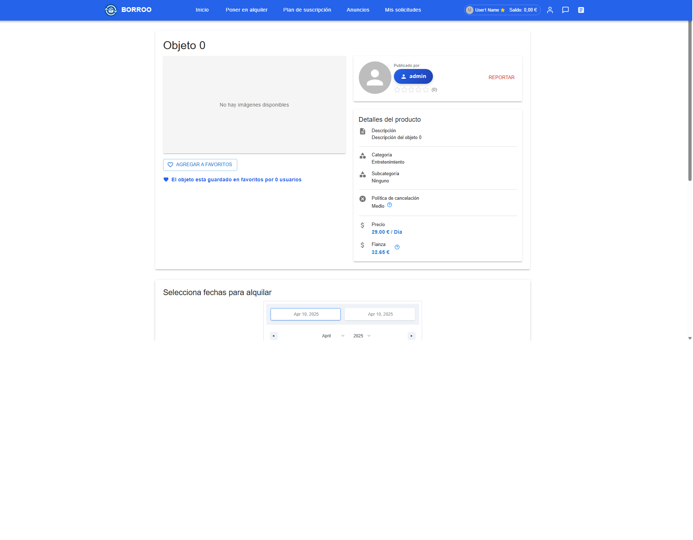

### Caso 10: Solicitar alquiler de objeto
1.  El usuario accede a la plataforma y navega por la página principal donde se muestran los objetos disponibles.
2.  El usuario selecciona un objeto específico para ver más detalles.
3.  El sistema muestra la información del objeto, incluyendo su precio, categoría y disponibilidad.
4.  El usuario selecciona el rango de fechas para el alquiler utilizando el calendario interactivo, que varía dependiendo del tipo de pago del alquiler (hora, dia, mes).
5.  El usuario presiona el botón "Solicitar alquiler". 
6.  El sistema muestra un cuadro de diálogo de confirmación con las fechas seleccionadas y el precio si el objeto esta disponible en la fecha seleccionada. Si no esta disponible en la fecha seleccionada, un mensaje emergente lo indica.
7.  El usuario confirma la solicitud presionando el botón "Confirmar".
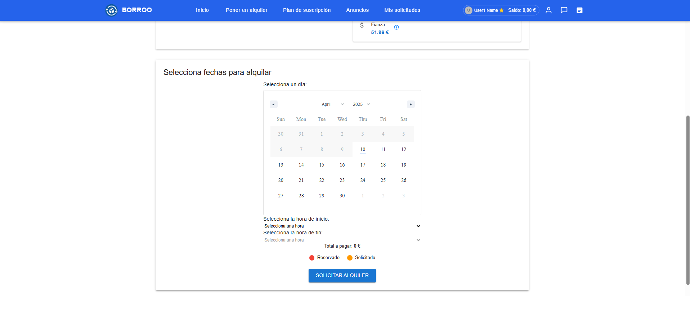
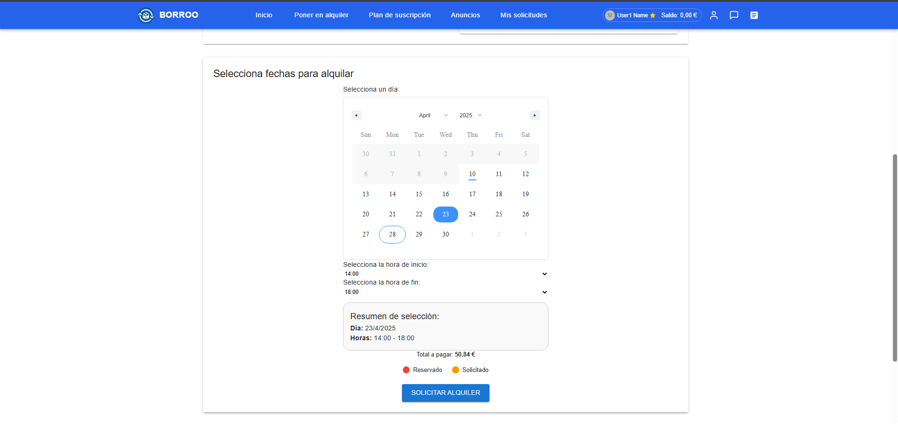
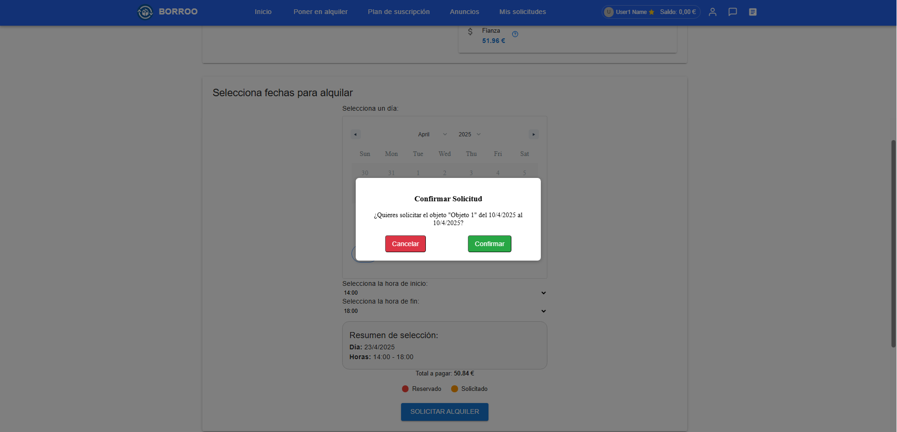
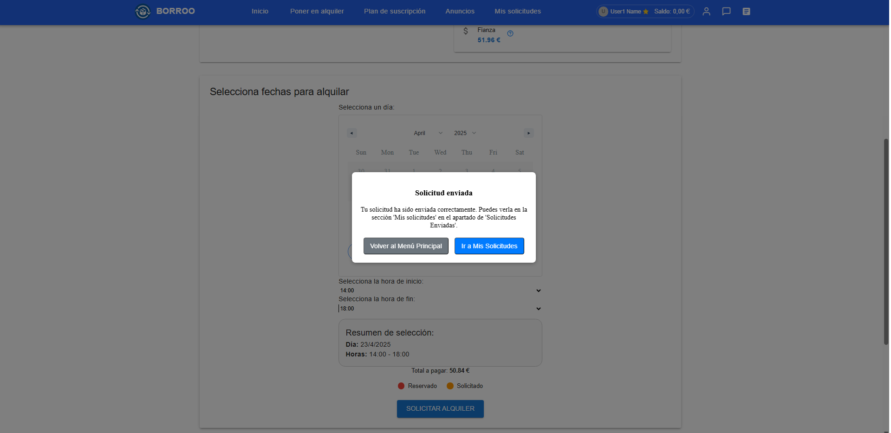

### Caso 11: Crear publicación de alquiler
1.  El usuario accede a la plataforma e inicia sesión.
2.  El usuario navega a la sección "Poner en alquiler".
3.  El sistema muestra un formulario para crear la publicación.
4.  El usuario completa los siguientes campos obligatorios:
    -   Título del objeto.
    -   Descripción del objeto.
    -   Categoría del objeto.
    -	Subcategoría del objeto.
    -   Política de cancelación (flexible, moderada, estricta, etc.).
    -   Unidad de precio (hora, día, semana, etc.).
    -   Precio del alquiler.
    -	Fianza
    -   El usuario debe añadir imágenes del objeto.
    -	Disponibilidad del producto.
5.  El usuario presiona el botón "Publicar" si quiere publicarlo ya, o lo guarda como borrador si quiere publicarlo posteriormente.
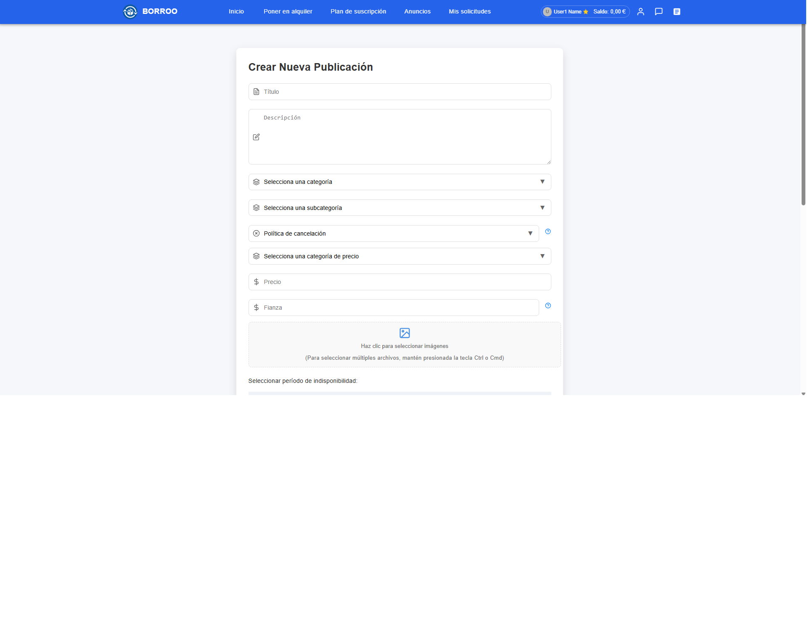
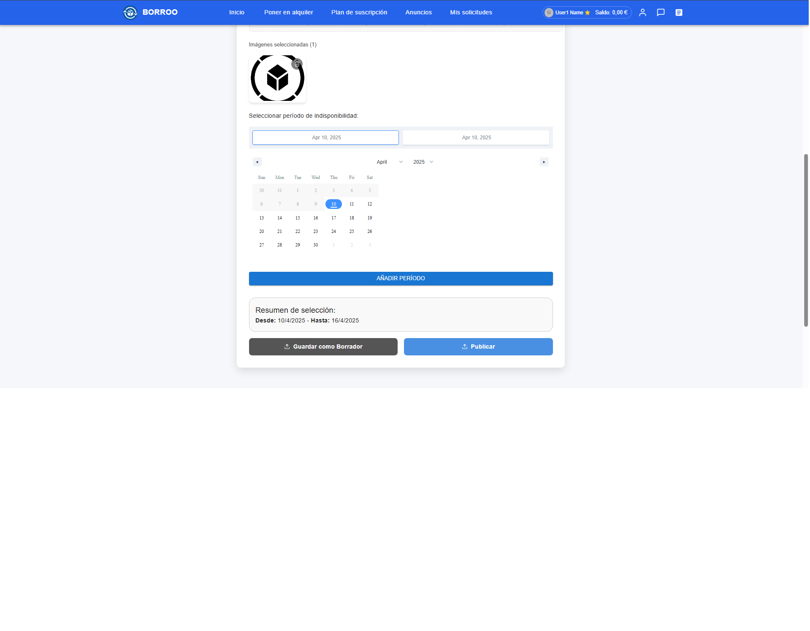
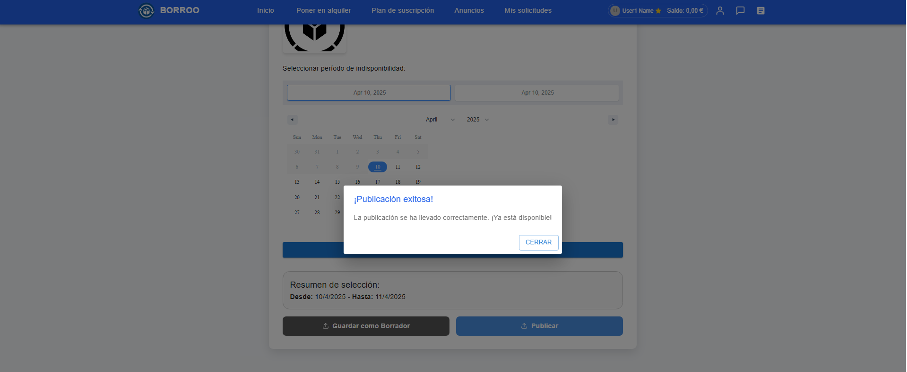

### Caso 12: Gestión de mis borradores
1. El usuario debe loggearse
2. El usuario debe presionar boton borradores
3. El usuario puede ver aquellos objetos que aun no ha publicado pero creo como borrador
4. El usuario puede publicar un borrador pulsando en el y posteriormente en "PUBLICAR"

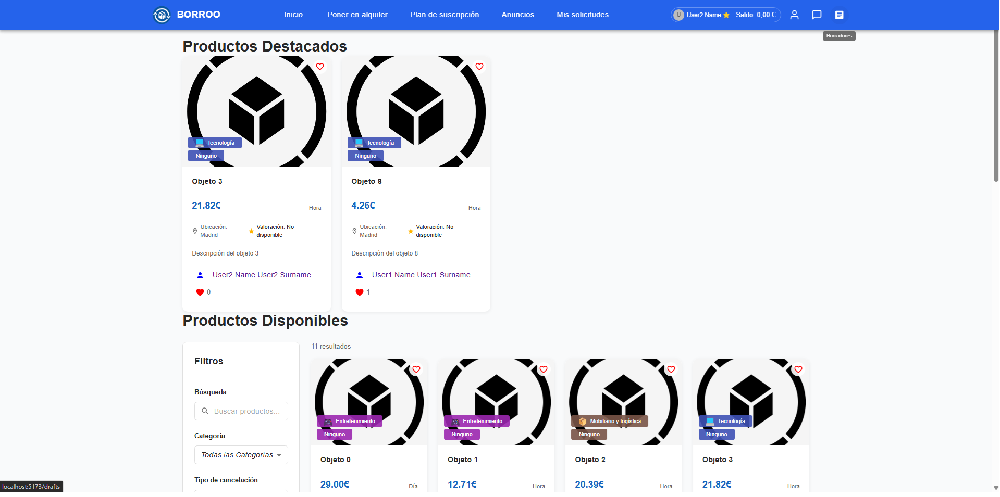
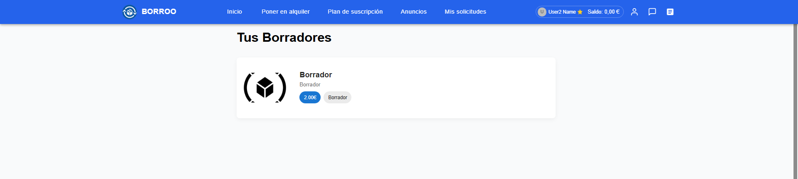
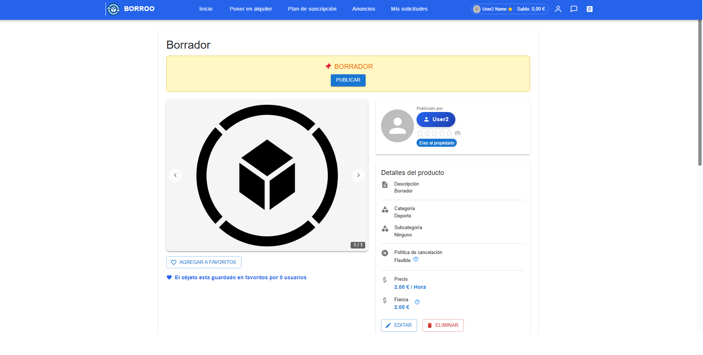

### Caso 13: Editar publicación de alquiler
1.  El usuario selecciona la publicación que desea editar.
2.  El usuario presiona el botón “editar”
3.	Se muestra por pantalla una pantalla de confirmación, el usuario pulsa el botón "Sí, editar".
3.  El sistema muestra el formulario con los datos actuales del objeto publicado.
4.  El usuario puede modificar los siguientes campos:
    -   Nombre del objeto.
    -   Descripción del objeto.
    -   Categoría.
    -	Subcategoría.
    -   Política de cancelación.
    -   Unidad de tiempo para el precio (hora, día, semana, etc.)
    -   Precio del alquiler.
    -	Fianza
    -   Imagen del objeto (opcional).
    -	Disponibilidad del producto.
5.  El usuario presiona el botón "Actualizar".
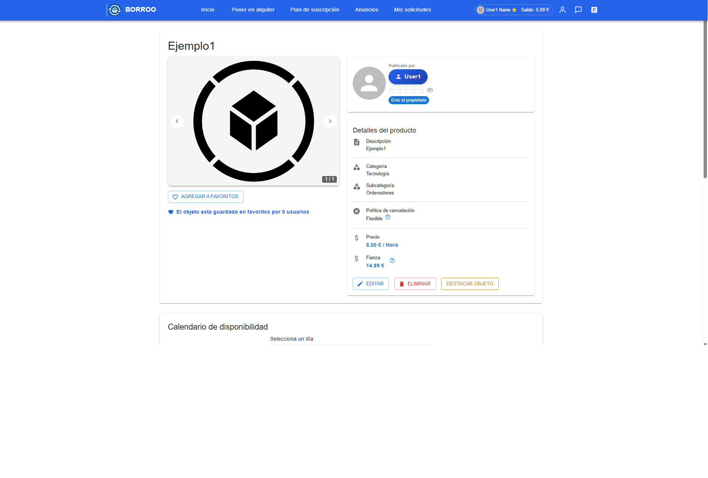
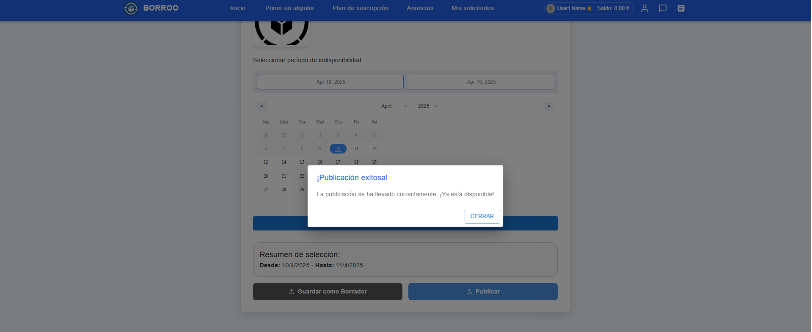
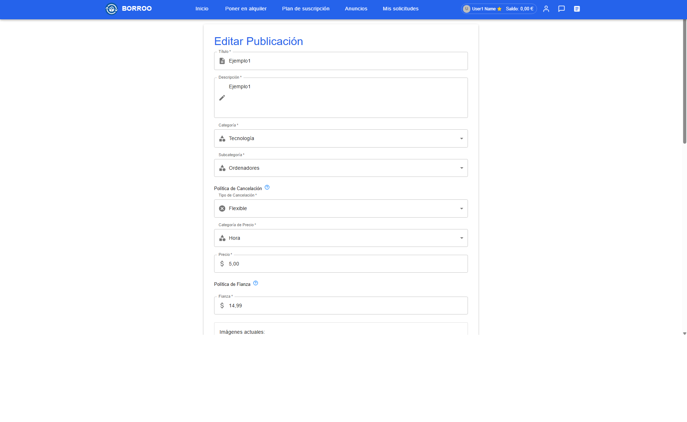
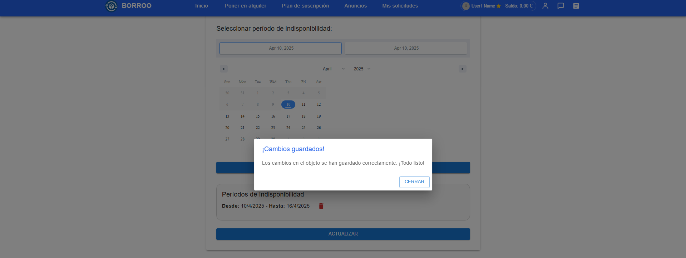

### Caso 14: Eliminar objeto de alquiler
1.  El usuario selecciona el anuncio del objeto que desea eliminar
2.  El usuario presiona el botón “Eliminar”
3.  Se indica por medio de un mensaje al usuario si está seguro de querer eliminar el anuncio del objeto
4.  El usuario presiona el botón de "Sí, eliminar"
5.	Se elimina el objeto
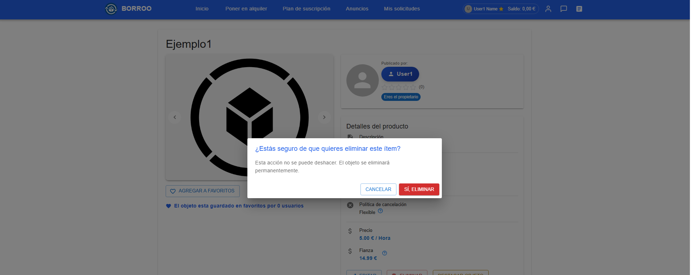

### Caso 15: Ver anuncios de solicitud
1.  El usuario navega a la sección "Anuncio".
2.	Se muestran todos los anuncios de solicitudes de alquiler publicados por los usuarios
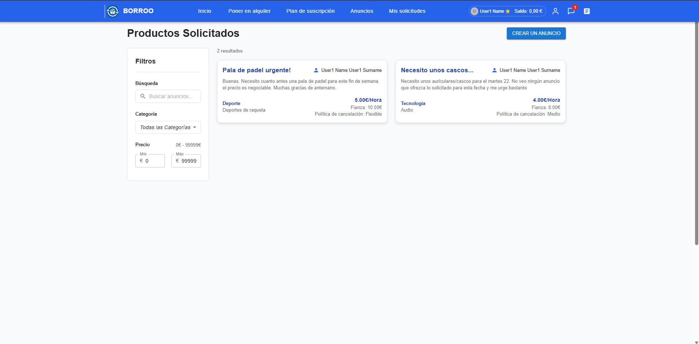

### Caso 16: Crear publicacion de anuncio
1.  El usuario accede a la plataforma e inicia sesión.
2.  El usuario navega a la sección "Anuncio".
3.  El sistema muestra un formulario para crear la publicación.
4.  El usuario completa los siguientes campos obligatorios:
    -   Título del objeto.
    -   Descripción del objeto.
    -   Categoría del objeto.
    -	Subcategoría del objeto
    -   Política de cancelación (flexible, moderada, estricta, etc.).
    -   Unidad de precio (hora, día, semana, etc.).
    -   Precio del alquiler
    -	Fianza
5.  El usuario presiona el botón "Publicar".
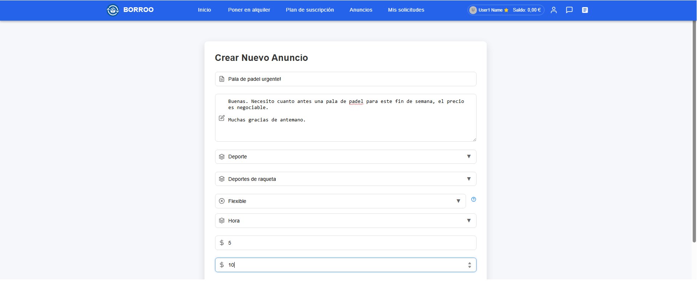

### Caso 17: Uso del chat
1. El usuario debe loggearse
2. El usuario debe ir al perfil de cualquier usuario (Descrito en caso "Ver perfil de otro usuario") y pulsar el botón enviar mensaje
3. El usuario emisor envía un mensaje, y se crea una conversación
4. El usuario que recibe el mensaje tiene una notificación en el botón "Mensajes" situado en la esquina superior.
5. EL usuario accede al chat y puede comunicarse con el usuario que le habló

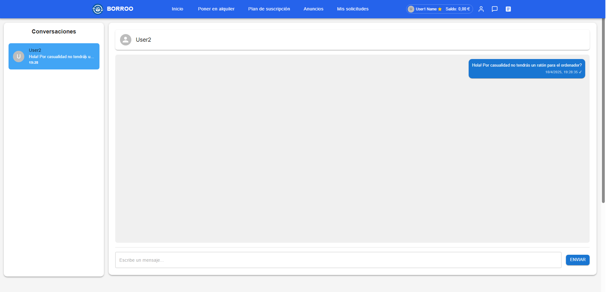
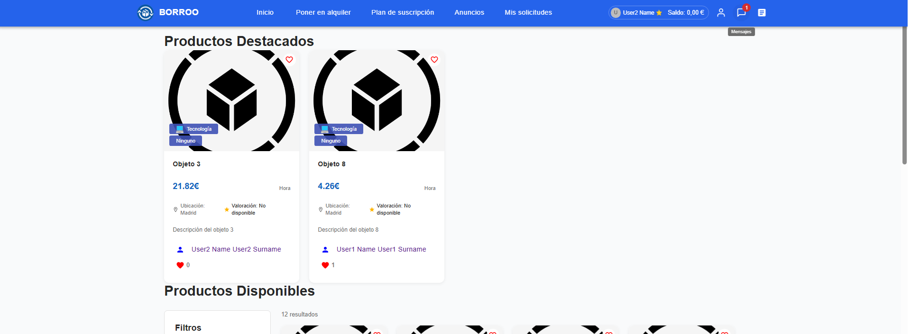
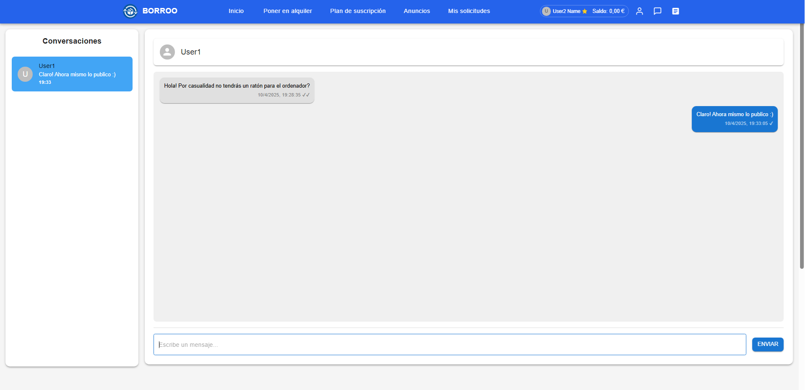

### Caso 18: Publicitarse
1. El usuario pulsa uno de los botones "¿Me ves? Publicitate" que hay en la pagina principal
2. El usuario navega a un formulario
3. El usuario rellena el formulario con los campos:
    - Nombre de la empresa
    - Sitio web
    - Sector o industria
    - Ubicacion principal (Ciudad/Pais)
    - Nombre de la persona de contacto
    - Cargo de la persona de contacto
    - Correo de contacto
    - Telefono
    - Productos a promocionar
    - Objetivo de su campaña
    - Que tipo de colaboración busca
    - Informacion adicional
4. El usuario rellena el formulario y le da a enviar
5. La empresa (borroo) recibe el correo, que se encarga de la gestion de la solicitud

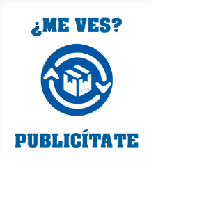
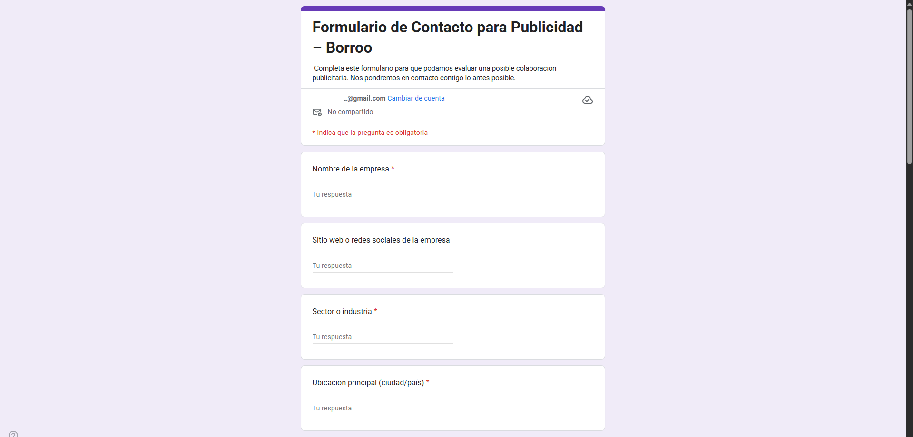

(Los anuncios y por tanto el boton comentado se suprimen si es premium)

### Caso 19: Pasar a plan premium
1. El usuario debe loggearse (Usuario sin plan premium actual, tiene una estrella al lado del nombre si es premium)
2. El usuario navega a la pestaña "Plan de suscripción"
3. El usuario selecciona "Mejora a premium"
4. El usuario selecciona si quiere pagar con saldo (si posee suficiente) o con tarjeta
5. Si el usuario selecciona pagar con tarjeta, rellena el formulario para el pago
6. El usuario presiona el botón "pagar"
7. Se muestra un mensaje de confirmación y se actualiza el plan del usuario (Se desactualiza solo al finalizar la mensualidad del plan)

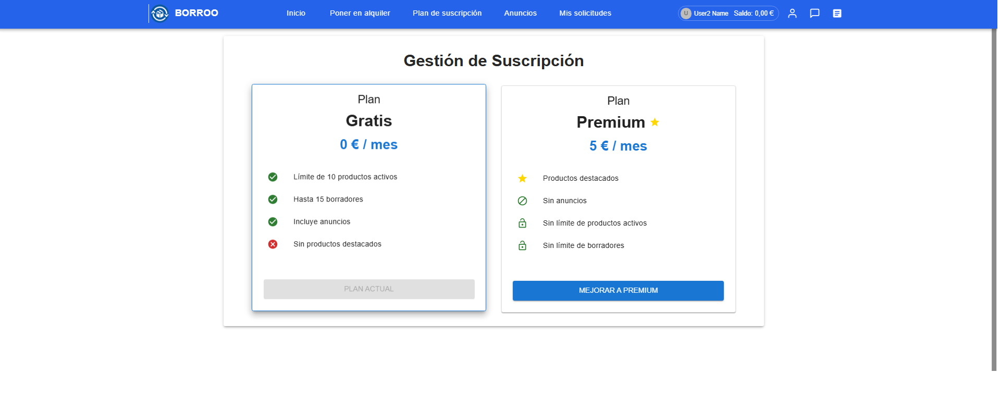
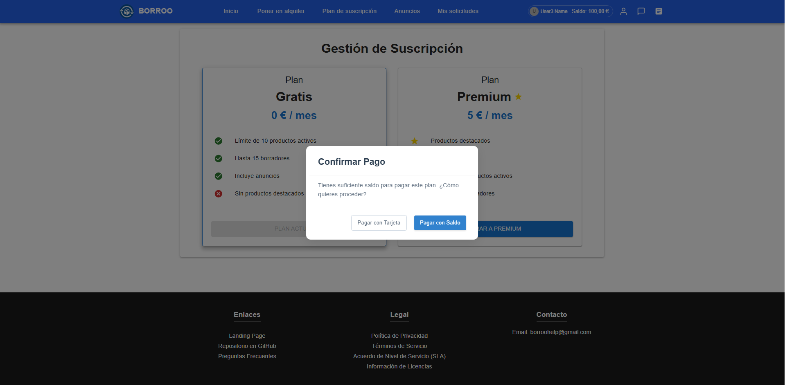
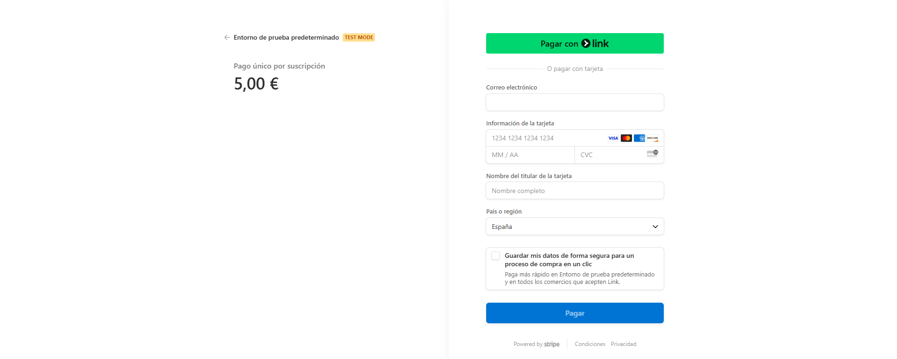
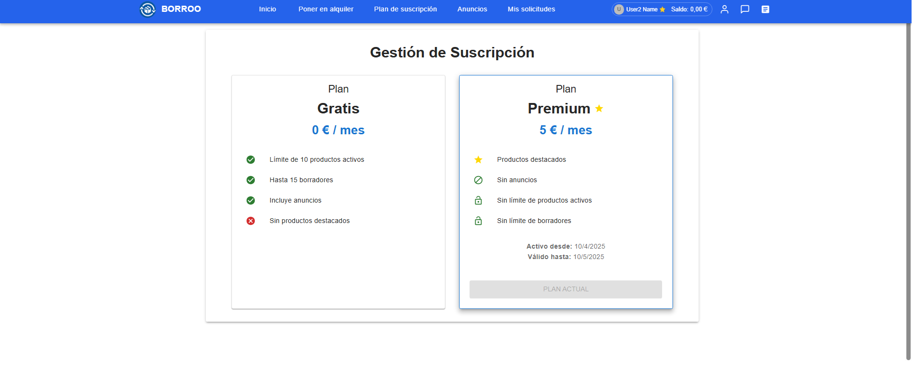

### Caso 20: Destacar un objeto
1. El usuario debe loggearse (Usuario con plan premium)
2. El usuario selecciona el objeto que desea destacar
3. El usuario presiona el boton "Destacar objeto"
4. El objeto se muestra a todos los usuarios en el apartado "Productos Destacados"

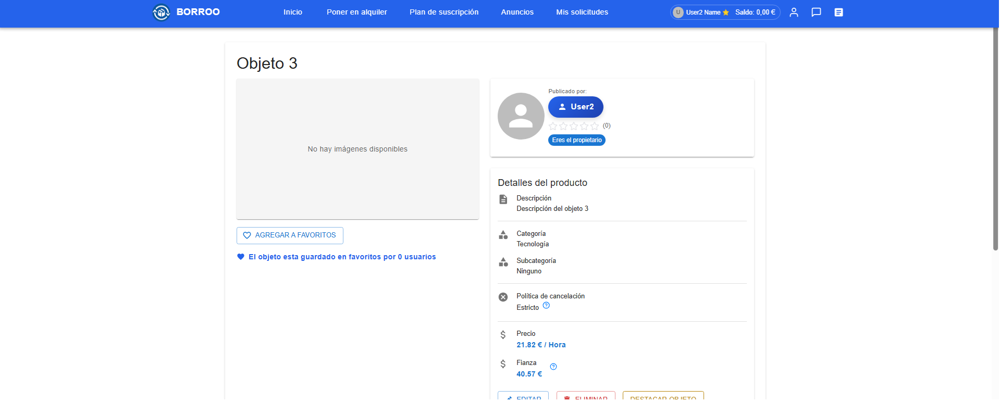
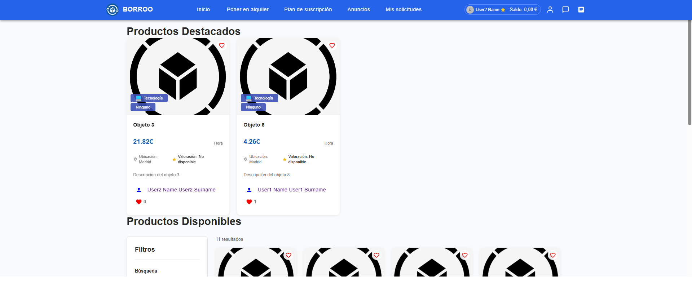

### Caso 21: Gestión de mis solicitudes (rentas) e incidencias
1. El usuario debe loggearse 
2. El usuario presiona el boton "Mis solicitudes" situado en la parte superior
3. El usuario puede observar las solicitudes de alquiler que ha enviado, que ha recibido y que ya fueron cerradas. Se muestra informacion sobre si estas ya fueron aceptadas, y si estas fueron pagadas
4. El usuario puede aceptar o rechazar un alquiler
5. Una vez se vence el alquiler, se pregunta a los usuarios si ambos fueron bien.
6. Si este fue bien, se manda un mensaje de agradecimiento y se procede con el pago por Stripe o con saldo
7. Si no fue bien, se abre un formulario de crear una incidencia.
8. El usuario puede ver sus incidencias en "Mi perfil" pulsando el botón "Ver mis incidencias en alquileres"

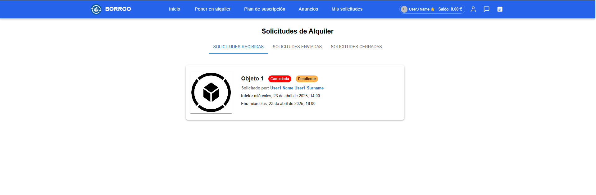
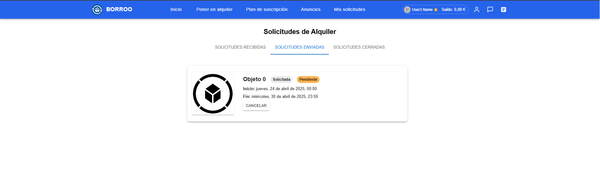
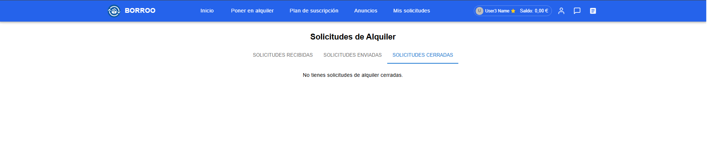
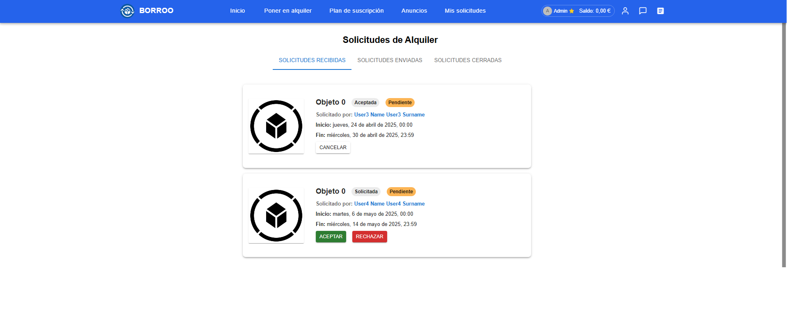
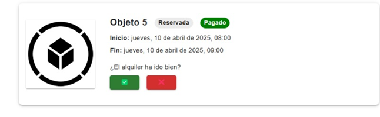
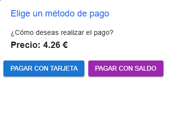


### Caso 22: Dejar valoraciones a usuarios
1. El usuario debe loggearse
2. El usuario accede al perfil de un usuario que le alquilo un objeto previamente (ya se ha realizado el pago y por tanto finalizado el periodo de alquiler)
3. El usuario rellena los datos y pulsa "Enviar valoración"
4. Si quisiese, el usuario puede ver 


### Caso 23: Vista y operaciones de administrador
1. El usuario debe loggearse como administrador (Credenciales indicadas al final del documento).
2. El usuario navega a la pestaña "Dashboard".
3. El usuario selecciona uno de los distintos menus, entre los que se encuentran:
    - Gestion de Usuarios
    - Gestion de Items
    - Gestion de Rentas

4. El usuario selecciona, en las distintas ventanas, las opciones para gestionar las entidades de la aplicación.
5. En caso de crear o actualizar, el usuario rellena los campos del formulario
6. El usuario presiona el botón "Guardar"


### Caso 24: Reportar usuario
1. El usuario debe loggearse
2. El usuario navega al perfil de otro usuario
3. El usuario presiona el boton reportar
4. El usuario rellena el formulario
5. El usuario presiona el boton "Enviar Reporte"
6. Se muestra un mensaje de que el reporte se envio correctamente
7. El usuario puede ver sus reportes en la pestaña "Mi perfil", pulsando el botón "Mis reportes"


### Caso 25: Gestión de reportes como administrador
1. El usuario debe loggearse como administrador
2. El usuario presiona el boton "Gestionar Reportes"
3. Se muestra un listado de reportes de los usuarios
4. El usuario adicionalmente puede filtrar los reportes en el boton de la esquina superior derecha
5. El usuario presiona "Actualizar estado"
6. El usuario cambia el estado del reporte y presiona "Guardar cambios"


### Caso 26: Gestión de incidencias como administrador
1. El usuario debe loggearse como administrador
2. El usuario presiona el boton "Gestionar Incidencias"
3. Se muestra un listado de reportes de los usuarios
4. El usuario selecciona la incidencia que quiera tratar, y se le muestra una vista con la información de la misma
5. El usuario puede presionar "Investigar", la incidencia pasa al estado "In progress" y se le muestra un mensaje al usuario por pantalla
6. El usuario puede presionar "Cerrar", la incidencia pasa al estado "Closed" y se le muestra un mensaje al usuario por pantalla


### Caso 27: Retirada de saldo
1. El usuario debe loggearse y tener saldo previamente (obtenido por alquileres)
2. El usuario accede a su perfil
3. El usuario presiona "retirar saldo"
4. El usuario selecciona el saldo a retirar y presiona "Confirmar retirada"


## 3. Datos necesarios para la revisión

**Los datos necesarios para la revisión son**: 

URL landing page: https://sites.google.com/view/borroo/

Credenciales usuario:  

    - User1 // Borroo_25

    - User2 // Borroo_25
 

 Administrador: 

    - admin_ispp // B0rr0o2025ISPP

 

URL deployment platform: https://frontend-wpl-dot-ispp2425-g4.ew.r.appspot.com/

URL Github Repository: https://github.com/ISPP-2425-G4/borroo 

URL y credenciales del “time tracking tool”: Desde clockify (en organización "ISPP"):

    - Credenciales: borrooclockify@gmail.com / Borroo2025
     (Para doble verificación solicitada por clockify, usar mismo correo y contraseña en gmail)

Numero de tarjeta:

    4242 4242 4242 4242

Cuenta bancaria retirada saldo:

    ES42 4242 4242 4242 4242 4242

Potential Requirements: Uso de internet para aplicacion desplegada, descrito en readme de git para aplicacion local 

Enlace video demo: https://www.youtube.com/watch?v=C5NcgEAohGg&ab_channel=BorrooApp

Enlaces a redes sociales:

    - Youtube: https://www.youtube.com/@BorrooApp

    - Instagram: https://www.instagram.com/borrooapp?igsh=MWdzZ3FtNGtvN2Yzcg==

    - Twitter/X: https://x.com/BorrooApp?t=b_10Yl5XpRp-etTCl4PpzA&s=09

    - Tiktok: https://www.tiktok.com/@borroo_app?_t=ZN-8w00oS7iwbe&_r=1

    - Facebook: https://www.facebook.com/profile.php?id=61575853589604

    - LinkedIn: https://www.linkedin.com/in/borroapp/
